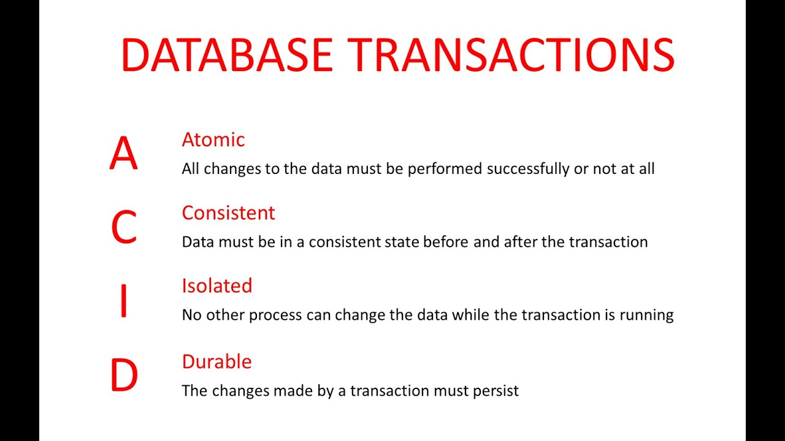

# System Design Notes

* This `README` was developed based on top of [System Design Primer document](https://github.com/donnemartin/system-design-primer#communication). However, this version contains additional notes and learnings that I appended to it as I walked through the material.

## Step 1: Review the scalability video lecture

* [Scalability Lecture at Harvard](https://www.youtube.com/watch?v=-W9F__D3oY4)

    * Topics covered:
        * Vertical scaling
        * Horizontal scaling
        * Caching
        * Load balancing
        * Database replication
        * Database partitioning

    * `FTP` traffics your username and password without any encryption (could get data sniffed on the network). 
        * Solution, use a newer protocol: `SFTP` 

    * `VPS` virtual private server
        * A company has a big server / cluster of servers, and by using a hypervisor they are able to give you an actual "slice" of the hardware
            * You could instal your own operating system, and you would not share resources with other users 
            * Hypervisors: VMWare, Citrix  
            * It is important to point out that those hypervisors can give you access to the virtual machine sitting on the server. That means that you have security in terms of sharing a resources with other clients, but the company that is hosting your data still have access to it.

    * `DNS`
        * `Round Robin`: Set a list of IPs to cycle whenever resolving the domain
        * `TTL`: time to live for the cache for that domain resolution 

    * `Load Balancers`
        * Balance the load based on CPU utilization and other metrics
            * Software:
                * AWS Elastic Load Balancer
                * HAProxy 
                    * open source software that you can run in a server
                * LVS (Linux virtual service)
            * Hardware:
                * Citrix
        * How to deal with systems that retain session data (sticky session)?
            * MySQL with data replication
            * The Load Balancer could inject a unique string into a cookie to identify the assigned backend server.
                * `set-cookie` header

    * `RAID`: Redundant Array of Independent Disks
        * Many function modes, some to increase readability speed by spreading a file in multiple disks, others to increase overall data redundancy.
        * `RAID 0`: By doing stripping you write a file in different disks (a chunk in each disk). This makes the process of writing faster.

        * `RAID 1`: You mirror data in two places at the same time. Overhead for writing, but overall good for redundancy.

        * `RAID 10`: You have both stripping and redundancy. Best of both worlds, but costs 2x

        * `RAID 5/6`: Nice variants of `RAID 1`. 
            * `RAID 5`: lets you have X drives, but only one used for redundancy (1 to N relation)
            * `RAID 6`: You use 2 hard drives for redundancy

    * `Caching`
        * `memcache`: key / store cache (stores data in RAM)
        * `mysql`: cache my sql queries
        * `html / files`: use nginx or any other proxy to cache files

    * `MySQL`
        * `innodb` supports transactions, `mysam` uses full table locks


## Step 2: Review the scalability article

* Clones

    * Steve should always get the same results of his request back, independent what server he  “landed on”. That leads to the first golden rule for scalability: every server contains exactly the same codebase and does not store any user-related data, like sessions or profile pictures, on local disc or memory. 

    * Sessions need to be stored in a centralized data store which is accessible to all your application servers. It can be an external database or an external persistent cache, like Redis. **An external persistent cache will have better performance than an external database. By external I mean that the data store does not reside on the application servers. Instead, it is somewhere in or near the data center of your application servers.**

        * What people often mean when asking this is "What are the benefits of using JWTs over using Server-side sessions".

        * With server-side sessions, you will either have to store the **session identifier** in a database, or else keep it in memory and make sure that the client always hits the same server. Both of these have drawbacks. In the case of the database (or other centralised storage), this becomes a bottleneck and a thing to maintain - essentially an extra query to be done with every request.

        * With an in-memory solution, you limit your horizontal scaling, and sessions will be affected by network issues (clients roaming between Wifi and mobile data, servers rebooting, etc).

        * Moving the session to the client means that you remove the dependency on a server-side session, but it imposes its own set of challenges.

            * Storing the token securely.
            * Transporting it securely.
            * JWT sessions can sometimes be hard to invalidate.
            * Trusting the client's claim.
            * These issues are shared by JWTs and other client-side session mechanisms alike.

        * JWT, in particular, addresses the last of these. It may help to understand what a JWT is:

        * It is a bit of information. For user sessions, you could include the username and the time when the token expires. But it could conceivably be anything, even the session ID or the user's entire profile (please don't do that though). It has got a secure signature that prevents malicious parties from generating fake tokens (you need access to the server's private key to sign them and you can verify that they were not modified after they were signed). You send them with every request, just like a cookie or Authorization Header would be sent. In fact, they are commonly sent in the HTTP Authorization header but using a cookie is fine too. 

            * local storage : simple key-value storage, the data is always stored as strings. The same data is accessible to all the pages of the domain and remains persistent even after you closed the browser.

                * localStorage is a way to store data on the client’s computer. It allows the saving of key/value pairs in a web browser and it stores data with no expiration date. localStorage can only be accessed via JavaScript, and HTML5. However, the user has the ability to clear the browser data/cache to erase all localStorage data.

                * Pros
                    * stores data with no expiration date
                    * storage limit is about 5MB
                    * data is never transferred to the server
                
                * Cons
                    * plaintext, hence not secure by design
                    * limited to string data, hence need to be serialized
                    * can only be read on client-side
            
            * session storage : same but is local to one URL and to one browser session (deleted on browser close).

                * stores data only for a session, meaning that the data is stored until the browser (or tab) is closed
                * data is never transferred to the server
                * can only be read on client-side
                * storage limit is about 5-10MB
                * opening multiple tabs/windows with the same URL creates sessionStorage for each tab/window
            
            * SQL database (aka WebSQL): storage in a local DB you can access by SQL requests... seems already deprecated as IE and Firefox have stated they won't implement it.

            * Cookies are small bits of data, (maximum of 4KB long), which hold data in a key=value pairs: `name=value; name2=value2`

                * Stores data that has to be sent back to the server with subsequent XHR requests. Its expiration varies based on the type and the expiration duration can be set from either server-side or client-side.
                * Cookies are primarily for server-side reading (can also be read on client-side), localStorage and sessionStorage can only be read on client-side.
                * Size must be less than 4KB.
                * Cookies can be made secure by setting the httpOnly flag as true for that cookie. This prevents client-side access to that cookie.

            * Cookies and local storage serve different purposes. Cookies are primarily for reading server-side, local storage can only be read by the client-side. So the question is, in your app, who needs this data — the client or the server

            * 

            * How to store tokens for Mobile apps
                * Well, there are different places this token should be stored depending on what platform you’re developing against. If you’re writing an Android app, for instance, you’ll want to store all access tokens in SharedPreferences (here’s the API docs you need to make it work). If you’re an iOS developer, you will want to store your access tokens in the Keychain.

                    * Store them as shared preferences. Those are by default private, and other apps cannot access them. On a rooted devices, if the user explicitly allows access to some app that is trying to read them, the app might be able to use them, but you cannot protect against that. As for encryption, you have to either require the user to enter the decrypt passphrase every time (thus defeating the purpose of caching credentials), or save the key to a file, and you get the same problem.

    * But what about deployment? How can you make sure that a code change is sent to all your servers without one server still serving old code? This tricky problem is fortunately already solved by the great tool Capistrano. It requires some learning, especially if you are not into Ruby on Rails, but it is definitely both the effort.

    * After “outsourcing” your sessions and serving the same codebase from all your servers, you can now create an image file from one of these servers (AWS calls this AMI - Amazon Machine Image.) Use this AMI as a “super-clone” that all your new instances are based upon. Whenever you start a new instance/clone, just do an initial deployment of your latest code and you are ready!

* Databases

    * Now the required changes are more radical than just adding more cloned servers and may even require some boldness. In the end, you can choose from 2 paths:

    * Path #1 is to stick with MySQL and keep the “beast” running. Hire a database administrator (DBA,) tell him to do master-slave replication (read from slaves, write to master) and upgrade your master server by adding RAM, RAM and more RAM. In some months, your DBA will come up with words like “sharding”, “denormalization” and “SQL tuning” and will look worried about the necessary overtime during the next weeks. At that point every new action to keep your database running will be more expensive and time consuming than the previous one. You might have been better off if you had chosen Path #2 while your dataset was still small and easy to migrate.

        * Denormalization is a strategy used on a previously-normalized database to increase performance. In computing, denormalization is the process of trying to improve the read performance of a database, at the expense of losing some write performance, by adding redundant copies of data or by grouping data. It is often motivated by performance or scalability in relational database software needing to carry out very large numbers of read operations. Denormalization differs from the unnormalized form in that denormalization benefits can only be fully realized on a data model that is otherwise normalized.

    * Path #2 means to denormalize right from the beginning and include no more Joins in any database query. You can stay with MySQL, and use it like a NoSQL database, or you can switch to a better and easier to scale NoSQL database like MongoDB or CouchDB. Joins will now need to be done in your application code. The sooner you do this step the less code you will have to change in the future. But even if you successfully switch to the latest and greatest NoSQL database and let your app do the dataset-joins, soon your database requests will again be slower and slower. You will need to introduce a cache.

* Caches

    * After following Part 2 of this series, you now have a scalable database solution. You have no fear of storing terabytes anymore and the world is looking fine. But just for you. Your users still have to suffer slow page requests when a lot of data is fetched from the database. The solution is the implementation of a cache.

    * With “cache” I always mean in-memory caches like Memcached or Redis. Please never do file-based caching, it makes cloning and auto-scaling of your servers just a pain. 

    * But back to in-memory caches. A cache is a simple key-value store and it should reside as a buffering layer between your application and your data storage. Whenever your application has to read data it should at first try to retrieve the data from your cache. Only if it’s not in the cache should it then try to get the data from the main data source. Why should you do that? Because a cache is lightning-fast. It holds every dataset in RAM and requests are handled as fast as technically possible. For example, Redis can do several hundreds of thousands of read operations per second when being hosted on a standard server. Also writes, especially increments, are very, very fast. Try that with a database!

    * #1 - Cached Database Queries

        * That’s still the most commonly used caching pattern. Whenever you do a query to your database, you store the result dataset in cache. A hashed version of your query is the cache key. The next time you run the query, you first check if it is already in the cache. The next time you run the query, you check at first the cache if there is already a result. This pattern has several issues. The main issue is the expiration. It is hard to delete a cached result when you cache a complex query (who has not?). When one piece of data changes (for example a table cell) you need to delete all cached queries who may include that table cell. You get the point?
    
    * #2 - Cached Objects

        * That’s my strong recommendation and I always prefer this pattern. In general, see your data as an object like you already do in your code (classes, instances, etc.). Let your class assemble a dataset from your database and then store the complete instance of the class or the assembed dataset in the cache. Sounds theoretical, I know, but just look how you normally code. You have, for example, a class called “Product” which has a property called “data”. It is an array containing prices, texts, pictures, and customer reviews of your product. The property “data” is filled by several methods in the class doing several database requests which are hard to cache, since many things relate to each other. Now, do the following: when your class has finished the “assembling” of the data array, directly store the data array, or better yet the complete instance of the class, in the cache! This allows you to easily get rid of the object whenever something did change and makes the overall operation of your code faster and more logical.
    
    * And the best part: it makes asynchronous processing possible! Just imagine an army of worker servers who assemble your objects for you! The application just consumes the latest cached object and nearly never touches the databases anymore!

    * Some ideas of objects to cache:

        * user sessions (never use the database!)
        * fully rendered blog articles
        * activity streams
        * user<->friend relationships 
    
    * As you maybe already realized, I am a huge fan of caching. It is easy to understand, very simple to implement and the result is always breathtaking. In general, I am more a friend of Redis than Memcached, because I love the extra database-features of Redis like persistence and the built-in data structures like lists and sets. With Redis and a clever key’ing there may be a chance that you even can get completly rid of a database. But if you just need to cache, take Memcached, because it scales like a charm.

    * Redis vs Memcache

        * Sub-millisecond latency
            * Both Redis and Memcached support sub-millisecond response times. By storing data in-memory they can read data more quickly than disk based databases.

        * Developer ease of use
            * Both Redis and Memcached are syntactically easy to use and require a minimal amount of code to integrate into your application.

        * Data partitioning
            * Both Redis and Memcached allow you to distribute your data among multiple nodes. This allows you to scale out to better handle more data when demand grows.

        * Support for a broad set of programming languages
            * Both Redis and Memcached have many open-source clients available for developers. Supported languages include Java, Python, PHP, C, C++, C#, JavaScript, Node.js, Ruby, Go and many others.

        * Advanced data structures
            * In addition to strings, Redis supports lists, sets, sorted sets, hashes, bit arrays, and hyperloglogs. Applications can use these more advanced data structures to support a variety of use cases. For example, you can use Redis Sorted Sets to easily implement a game leaderboard that keeps a list of players sorted by their rank.

        * Multithreaded architecture
            * Since Memcached is multithreaded, it can make use of multiple processing cores. This means that you can handle more operations by scaling up compute capacity.

        * Snapshots
            * With Redis you can keep your data on disk with a point in time snapshot which can be used for archiving or recovery.

        * Replication
            * Redis lets you create multiple replicas of a Redis primary. This allows you to scale database reads and to have highly available clusters.

        * Transactions
            * Redis supports transactions which let you execute a group of commands as an isolated and atomic operation.

        * Pub/Sub
            * Redis supports Pub/Sub messaging with pattern matching which you can use for high performance chat rooms, real-time comment streams, social media feeds, and server intercommunication.

        * Lua scripting
            * Redis allows you to execute transactional Lua scripts. Scripts can help you boost performance and simplify your application.

        * Geospatial support
            * Redis has purpose-built commands for working with real-time geospatial data at scale. You can perform operations like finding the distance between two elements (for example people or places) and finding all elements within a given distance of a point.

* Asynchronism

    * Asynchronous Messaging Patterns

        * Asynchronous messaging is a messaging scheme where message production by a producer is decoupled from its processing by a consumer. When dealing with messaging systems, we typically identify two main messaging patterns — message queuing and publish/subscribe.

        * Message queueing

            * In the message-queuing communication pattern, queues temporally decouple producers from consumers. Multiple producers can send messages to the same queue; however, when a consumer processes a message, it’s locked or removed from the queue and is no longer available. Only a single consumer consumes a specific message.

            * 

            * As a side note, if the consumer fails to process a certain message, the messaging platform typically returns the message to the queue where it’s made available for other consumers. Besides temporal decoupling, queues allow us to scale producers and consumers independently as well as providing a degree of fault-tolerance against processing errors.
        
        * Publish/subscribe

            * In the publish/subscribe (or pub/sub) communication pattern, a single message can be received and processed by multiple subscribers concurrently.

            * 

            * This pattern allows a publisher, for example, to notify all subscribers that something has happened in the system. Many queuing platforms often associate pub/sub with the term topics. In RabbitMQ, topics are a specific type of pub/sub implementation (a type of exchange to be exact), but for this piece, I refer to topics as a representation of pub/sub as a whole.

            * Generically speaking, there are two types of subscriptions:

                * An ephemeral subscription, where the subscription is only active as long the consumer is up and running. Once the consumer shuts down, their subscription and yet-to-be processed messages are lost.

                * A durable subscription, where the subscription is maintained as long as it’s not explicitly deleted. When the consumer shuts down, the messaging platform maintains the subscription, and message processing can be resumed later.
            
            * RabbitMQ

                * RabbitMQ is an implementation of a message broker — often referred to as a service bus. It natively supports both messaging patterns described above. Other popular implementations of message brokers include ActiveMQ, ZeroMQ, Azure Service Bus, and Amazon Simple Queue Service (SQS). All of these implementations have a lot in common; many concepts described in this piece apply to most of them.

                * Queues

                    * RabbitMQ supports classic message queuing out of the box. A developer defines named queues, and then publishers can send messages to that named queue. Consumers, in turn, use the same queue to retrieve messages to process them.
                
                * Message exchanges

                    * RabbitMQ implements pub/sub via the use of message exchanges. A publisher publishes its messages to a message exchange without knowing who the subscribers of these messages are.

                    * Each consumer wishing to subscribe to an exchange creates a queue; the message exchange then queues produced messages for consumers to consume. It can also filter messages for some subscribers based on various routing rules.

                     

                    * It’s important to note RabbitMQ supports both ephemeral and durable subscriptions. A consumer can decide the type of subscription they’d like to employ via RabbitMQ’s API.

                    * Due to RabbitMQ’s architecture, we can also create a hybrid approach — where some subscribers form consumer groups that work together processing messages in the form of competing consumers over a specific queue. In this manner, we implement the pub/sub pattern while also allowing some subscribers to scale-up to handle received messages.

                     

            * Apache Kafka

                * Apache Kafka isn’t an implementation of a message broker. Instead, it’s a distributed streaming platform.

                * Unlike RabbitMQ, which is based on queues and exchanges, Kafka’s storage layer is implemented using a partitioned transaction log. Kafka also provides a Streams API to process streams in real time and a Connectors API for easy integration with various data sources; however, these are out of the scope of this piece.

                * The cloud vendors provide alternative solutions for Kafka’s storage layer. These solutions include Azure Event Hubs and, to some extent, AWS Kinesis Data Streams. There are also cloud-specific and open-source alternatives to Kafka’s stream processing capabilities, but, again, these are out of the scope of this post.

                * Topics

                    * Kafka doesn’t implement the notion of a queue. Instead, Kafka stores collections of records in categories called topics.

                    * For each topic, Kafka maintains a partitioned log of messages. Each partition is an ordered, immutable sequence of records, where messages are continually appended.

                    * Kafka appends messages to these partitions as they arrive. By default, it uses a round-robin partitioner to spread messages uniformly across partitions.

                    * Producers can modify this behavior to create logical streams of messages. For example, in a multitenant application, we might want to create logical message streams according to every message’s tenant ID. In an IoT scenario, we might want to have each producer’s identity map to a specific partition constantly. Making sure all messages from the same logical stream map to the same partition guarantees their delivery in order to consumers.

                    * 

                    * Consumers consume messages by maintaining an offset (or index) to these partitions and reading them sequentially.

                    * A single consumer can consume multiple topics, and consumers can scale up to the number of partitions available.

                    * As a result, when creating a topic, one should carefully consider the expected throughput of messaging on that topic. A group of consumers working together to consume a topic is called a consumer group. Kafka’s API typically handles the balancing of partition processing between consumers in a consumer group and the storing of consumers’ current partition offsets.

                    * 

                * Implementing messaging patterns with Kafka

                    * Kafka’s implementation maps quite well to the pub/sub pattern.

                    * A producer can send messages to a specific topic, and multiple consumer groups can consume the same message. Each consumer group can scale individually to handle the load. Since consumers maintain their partition offset, they can choose to have a durable subscription that maintains its offset across restarts or an ephemeral subscription, which throws the offset away and restarts from the latest record in each partition every time it starts up.

                    * A producer can send messages to a specific topic, and multiple consumer groups can consume the same message. Each consumer group can scale individually to handle the load. Since consumers maintain their partition offset, they can choose to have a durable subscription that maintains its offset across restarts or an ephemeral subscription, which throws the offset away and restarts from the latest record in each partition every time it starts up.
                    
                    * However, it’s a less-than-perfect fit for the message-queuing pattern. Of course, we could have a topic with just a single consumer group to emulate classic message queuing. Nevertheless, this has multiple drawbacks Part 2 of this piece discusses at length.

                    * It’s important to note Kafka retains messages in partitions up to a preconfigured period, regardless of whether consumers consumed these messages. This retention means consumers are free to reread past messages. Furthermore, developers can also use Kafka’s storage layer for implementing mechanisms such as event sourcing and audit logs.

        * Closing Words
            * While RabbitMQ and Kafka are sometimes interchangeable, their implementations are very different from each other. As a result, we can’t view them as members of the same category of tools; one is a message broker, and the other is a distributed streaming platform.

            * As solution architects, we should acknowledge these differences and actively consider which of these types of solutions we should use for a given scenario. Part 2 addresses these differences and provides guidance on when to use each.

    * Async #1
        * Let’s stay in the former bakery picture. The first way of async processing is the “bake the breads at night and sell them in the morning” way. No waiting time at the cash register and a happy customer.  Referring to a web app this means doing the time-consuming work in advance and serving the finished work with a low request time.

        * Very often this paradigm is used to turn dynamic content into static content.  Pages of a website, maybe built with a massive framework or CMS, are pre-rendered and locally stored as static HTML files on every change. Often these computing tasks are done on a regular basis, maybe by a script which is called every hour by a cronjob. This pre-computing of overall general data can extremely improve websites and web apps and makes them very scalable and performant. Just imagine the scalability of your website if the script would upload these pre-rendered HTML pages to AWS S3 or Cloudfront or another Content Delivery Network! Your website would be super responsive and could handle millions of visitors per hour!
    
    * Async #2
        * Back to the bakery. Unfortunately, sometimes customers has special requests like a birthday cake with “Happy Birthday, Steve!” on it. The bakery can not foresee these kind of customer wishes, so it must start the task when the customer is in the bakery and tell him to come back at the next day. Refering to a web service that means to handle tasks asynchronously.

        * Here is a typical workflow:

        * A user comes to your website and starts a very computing intensive task which would take several minutes to finish. So the frontend of your website sends a job onto a job queue and immediately signals back to the user: your job is in work, please continue to the browse the page. The job queue is constantly checked by a bunch of workers for new jobs. If there is a new job then the worker does the job and after some minutes sends a signal that the job was done. The frontend, which constantly checks for new “job is done” - signals, sees that the job was done and informs the user about it. I know, that was a very simplified example. 

        * If you now want to dive more into the details and actual technical design, I recommend you take a look at the first 3 tutorials on the RabbitMQ website. RabbitMQ is one of many systems which help to implement async processing. You could also use ActiveMQ or a simple Redis list. The basic idea is to have a queue of tasks or jobs that a worker can process. Asynchronism seems complicated, but it is definitely worth your time to learn about it and implement it yourself. Backends become nearly infinitely scalable and frontends become snappy which is good for the overall user experience. 

        * If you do something time-consuming, try to do it always asynchronously. 

## Next steps

Next, we'll look at high-level trade-offs:

* Performance vs scalability
* Latency vs throughput
* Availability vs consistency

* Keep in mind that everything is a trade-off.

* **Performance vs scalability**
    * A service is scalable if it results in increased performance in a manner proportional to resources added. Generally, increasing performance means serving more units of work, but it can also be to handle larger units of work, such as when datasets grow.1

    * Another way to look at performance vs scalability:

        * If you have a performance problem, your system is slow for a single user.
        * If you have a scalability problem, your system is fast for a single user but slow under heavy load.

    * Why is scalability so hard? Because scalability cannot be an after-thought. It requires applications and platforms to be designed with scaling in mind, such that adding resources actually results in improving the performance or that if redundancy is introduced the system performance is not adversely affected. Many algorithms that perform reasonably well under low load and small datasets can explode in cost if either requests rates increase, the dataset grows or the number of nodes in the distributed system increases.

* **Latency vs throughput**

    * Latency is the time to perform some action or to produce some result.

    * Throughput is the number of such actions or results per unit of time.

    * Generally, you should aim for maximal throughput with acceptable latency.

* **Availability vs consistency**

    * CAP theorem

        *  
    
    * In a distributed computer system, you can only support two of the following guarantees:

        * Consistency - Every read receives the most recent write or an error
        * Availability - Every request receives a response, without guarantee that it contains the most recent version of the information
        * Partition Tolerance - The system continues to operate despite arbitrary partitioning due to network failures
    
    * CP - consistency and partition tolerance

        * Waiting for a response from the partitioned node might result in a timeout error. CP is a good choice if your business needs require atomic reads and writes.
    
    * AP - availability and partition tolerance

        * Responses return the most readily available version of the data available on any node, which might not be the latest. Writes might take some time to propagate when the partition is resolved.

        * AP is a good choice if the business needs allow for eventual consistency or when the system needs to continue working despite external errors.

        * The decision between Consistency and Availability is a software trade off. You can choose what to do in the face of a network partition - the control is in your hands. Network outages, both temporary and permanent, are a fact of life and occur whether you want them to or not - this exists outside of your software.

    * Consistency patterns

        * With multiple copies of the same data, we are faced with options on how to synchronize them so clients have a consistent view of the data. Recall the definition of consistency from the CAP theorem - Every read receives the most recent write or an error.

        * Weak consistency

            * After a write, reads may or may not see it. A best effort approach is taken.

            * This approach is seen in systems such as memcached. Weak consistency works well in real time use cases such as VoIP, video chat, and realtime multiplayer games. For example, if you are on a phone call and lose reception for a few seconds, when you regain connection you do not hear what was spoken during connection loss.
        
        * Eventual consistency

            * After a write, reads will eventually see it (typically within milliseconds). Data is replicated asynchronously.

            * This approach is seen in systems such as DNS and email. Eventual consistency works well in highly available systems.
        
        * Strong consistency
            * After a write, reads will see it. Data is replicated synchronously.

            * This approach is seen in file systems and RDBMSes. Strong consistency works well in systems that need transactions.

* Availability patterns

    * There are two complementary patterns to support high availability: fail-over and replication.

    * **Fail-over**

        * Active-passive

            * With active-passive fail-over, heartbeats are sent between the active and the passive server on standby. If the heartbeat is interrupted, the passive server takes over the active's IP address and resumes service.

            * The length of downtime is determined by whether the passive server is already running in 'hot' standby or whether it needs to start up from 'cold' standby. Only the active server handles traffic.

            * Active-passive failover can also be referred to as master-slave failover.
        
        * Active-active

            * In active-active, both servers are managing traffic, spreading the load between them.

            * If the servers are public-facing, the DNS would need to know about the public IPs of both servers. If the servers are internal-facing, application logic would need to know about both servers.

            * Active-active failover can also be referred to as master-master failover.

        * Disadvantage(s): failover

            * Fail-over adds more hardware and additional complexity.
            * There is a potential for loss of data if the active system fails before any newly written data can be replicated to the passive.
    

    * **Replication**

        * ACID
            * 
                * Consistent: Only valid data is saved. A transaction should respect the data integrity rules

        * Master-slave and master-master

            * The master serves reads and writes, replicating writes to one or more slaves, which serve only reads. Slaves can also replicate to additional slaves in a tree-like fashion. If the master goes offline, the system can continue to operate in read-only mode until a slave is promoted to a master or a new master is provisioned.

            * 

            * Disadvantage(s): master-slave replication

                * Additional logic is needed to promote a slave to a master.

        * Master-master replication

            * Both masters serve reads and writes and coordinate with each other on writes. If either master goes down, the system can continue to operate with both reads and writes.

            * 

            * Disadvantage(s): master-master replication

                * You'll need a load balancer or you'll need to make changes to your application logic to determine where to write.

                * Most master-master systems are either loosely consistent (violating ACID) or have increased write latency due to synchronization.

                * Conflict resolution comes more into play as more write nodes are added and as latency increases.

* Availability in numbers

    * Availability is often quantified by uptime (or downtime) as a percentage of time the service is available. Availability is generally measured in number of 9s--a service with 99.99% availability is described as having four 9s.

    * Availability in parallel vs in sequence

        * If a service consists of multiple components prone to failure, the service's overall availability depends on whether the components are in sequence or in parallel.

        * In sequence

            * Overall availability decreases when two components with availability < 100% are in sequence:

                * `Availability (Total) = Availability (Foo) * Availability (Bar)`
                
                * If both Foo and Bar each had 99.9% availability, their total availability in sequence would be 99.8%.
        
        * In parallel
            * Overall availability increases when two components with availability < 100% are in parallel:

                * `Availability (Total) = 1 - (1 - Availability (Foo)) * (1 - Availability (Bar))`
            
            * If both Foo and Bar each had 99.9% availability, their total availability in parallel would be 99.9999%.

## Domain name system

* 

* A Domain Name System (DNS) translates a domain name such as www.example.com to an IP address.

* DNS is hierarchical, with a few authoritative servers at the top level. Your router or ISP provides information about which DNS server(s) to contact when doing a lookup. Lower level DNS servers cache mappings, which could become stale due to DNS propagation delays. DNS results can also be cached by your browser or OS for a certain period of time, determined by the time to live (TTL).

    * NS record (name server) - Specifies the DNS servers for your domain/subdomain.
    * MX record (mail exchange) - Specifies the mail servers for accepting messages.
    * A record (address) - Points a name to an IP address.
    * CNAME (canonical) - Points a name to another name or CNAME (example.com to www.example.com) or to an A record.

* Services such as CloudFlare and Route 53 provide managed DNS services. Some DNS services can route traffic through various methods:

    * Weighted round robin
        * Prevent traffic from going to servers under maintenance
        * Balance between varying cluster sizes
        * A/B testing
    
    * Latency-based
        * If your application is hosted in multiple AWS Regions, you can improve performance for your users by serving their requests from the AWS Region that provides the lowest latency.
    
    * Geolocation-based

* Disadvantage(s): DNS

    * Accessing a DNS server introduces a slight delay, although mitigated by caching described above.

    * DNS server management could be complex and is generally managed by governments, ISPs, and large companies.

    * DNS services have recently come under DDoS attack, preventing users from accessing websites such as Twitter without knowing Twitter's IP address(es).

## Content delivery network

* 

* A content delivery network (CDN) is a globally distributed network of proxy servers, serving content from locations closer to the user. Generally, static files such as HTML/CSS/JS, photos, and videos are served from CDN, although some CDNs such as Amazon's CloudFront support dynamic content. The site's DNS resolution will tell clients which server to contact.

* Serving content from CDNs can significantly improve performance in two ways:

    * Users receive content from data centers close to them

    * Your servers do not have to serve requests that the CDN fulfills

* Pull CDN: Imagine a person loading your latest travel blog post. It probably has pictures in it, as does your site’s theme (e.g. icons, background images, etc.) For this example let’s have your hosting server be in Boston. You’ve just published your latest travel blog post and your biggest fan in Japan wants to read it. With a pull CDN, the very first time she does, the content isn’t on the CDN. During this first request, the CDN “pulls” the images and so forth to CDN server nearest your Japanese fan. That could be Tokyo or Hong Kong, whichever it is, the very first time the CDN has to pull the post, meaning your server and reader won’t see any gain in speed. The second time however (and usually for 1-30 days later) the CDN has the content loaded and it’s will be available to everyone who is closest to that Tokyo or Hong Kong CDN server.

* Push CDN: Going along with the example above, instead of waiting around for the CDN to pull the content when it’s needed, you simply upload the entire content of your travel blog to the CDN beforehand. That way your pictures, theme files, videos, and the rest are always on the CDN servers around the world.

* In general, a pull CDN is much easier to configure than a push CDN. Once initially configured, a pull CDN rather seamlessly stores and updates content on its servers as its requested. The data usually stays there for 24 hours or longer if the CDN doesn’t detect that a file has been modified. For low traffic sites or those that are sufficiently optimized with caching, good code, and more, a pull CDN provides speed without asking much of your server. Once your content is pulled (give it 48 hours to get enough data to make it a noticeable difference) the maintenance required is low.

* So what makes a pull CDN so easy can also be a pain, especially when you’re making changes to your travel blog. Typically you don’t have control over how long the pull CDN cache lasts, so if you update a photo or theme, it might take up to 24 hours for all of your readers (and you) to see it. You lose control for ease so when it comes to making widespread changes like updating your theme, you often have to shut off the CDN during the process.

* Conversely, a push CDN can put added strain on your server if it’s underpowered for your traffic, or you have lots of changing content in a given day. The reason being, pushing all of your data and any changes as they happen to the CDN takes work on your server’s part. If your server is already struggling under heavy load (here are a few tips to optimize your site) or has new content several times a day, all of them syncing between your server and the CDN might do more harm than good.

## Load Balancer


* Load balancers distribute incoming client requests to computing resources such as application servers and databases. In each case, the load balancer returns the response from the computing resource to the appropriate client. Load balancers are effective at:

    * Preventing requests from going to unhealthy servers
    * Preventing overloading resources
    * Helping to eliminate a single point of failure

* Load balancers can be implemented with hardware (expensive) or with software such as HAProxy.

* Additional benefits include:

    * SSL termination - Decrypt incoming requests and encrypt server responses so backend servers do not have to perform these potentially expensive operations
        * Removes the need to install X.509 certificates on each server

    * Session persistence - Issue cookies and route a specific client's requests to same instance if the web apps do not keep track of sessions

* To protect against failures, it's common to set up multiple load balancers, either in active-passive or active-active mode.

* Load balancers can route traffic based on various metrics, including:

    * Random
    * Least loaded
    * Session/cookies
    * Round robin or weighted round robin
    * Layer 4
    * Layer 7

* Layer 4 load balancing

    * Layer 4 load balancers look at info at the transport layer to decide how to distribute requests. Generally, this involves the source, destination IP addresses, and ports in the header, but not the contents of the packet. Layer 4 load balancers forward network packets to and from the upstream server, performing Network Address Translation (NAT).

* Layer 7 load balancing

    * Layer 7 load balancers look at the application layer to decide how to distribute requests. This can involve contents of the header, message, and cookies. Layer 7 load balancers terminate network traffic, reads the message, makes a load-balancing decision, then opens a connection to the selected server. For example, a layer 7 load balancer can direct video traffic to servers that host videos while directing more sensitive user billing traffic to security-hardened servers.

    * At the cost of flexibility, layer 4 load balancing requires less time and computing resources than Layer 7, although the performance impact can be minimal on modern commodity hardware.

* Horizontal scaling

    * Load balancers can also help with horizontal scaling, improving performance and availability. Scaling out using commodity machines is more cost efficient and results in higher availability than scaling up a single server on more expensive hardware, called Vertical Scaling. It is also easier to hire for talent working on commodity hardware than it is for specialized enterprise systems.

    * Disadvantage(s): horizontal scaling

    * Scaling horizontally introduces complexity and involves cloning servers
        * Servers should be stateless: they should not contain any user-related data like sessions or profile pictures
        * Sessions can be stored in a centralized data store such as a database (SQL, NoSQL) or a persistent cache (Redis, Memcached)
    * Downstream servers such as caches and databases need to handle more simultaneous connections as upstream servers scale out

* Disadvantage(s): load balancer
    * The load balancer can become a performance bottleneck if it does not have enough resources or if it is not configured properly.
    * Introducing a load balancer to help eliminate a single point of failure results in increased complexity.
    * A single load balancer is a single point of failure, configuring multiple load balancers further increases complexity.


## Reverse proxy (web server)

* 

* A reverse proxy is a web server that centralizes internal services and provides unified interfaces to the public. Requests from clients are forwarded to a server that can fulfill it before the reverse proxy returns the server's response to the client.

* Additional benefits include:

    * Increased security - Hide information about backend servers, blacklist IPs, limit number of connections per client
    * Increased scalability and flexibility - Clients only see the reverse proxy's IP, allowing you to scale servers or change their configuration
    * SSL termination - Decrypt incoming requests and encrypt server responses so backend servers do not have to perform these potentially expensive operations
    * Removes the need to install X.509 certificates on each server
    * Compression - Compress server responses
    * Caching - Return the response for cached requests
    * Static content - Serve static content directly
        * HTML/CSS/JS
        * Photos
        * Videos
        * Etc

* Load balancer vs reverse proxy

    * Deploying a load balancer is useful when you have multiple servers. Often, load balancers route traffic to a set of servers serving the same function.
    * Reverse proxies can be useful even with just one web server or application server, opening up the benefits described in the previous section.
    * Solutions such as NGINX and HAProxy can support both layer 7 reverse proxying and load balancing.

* Disadvantage(s): reverse proxy

    * Introducing a reverse proxy results in increased complexity.
    * A single reverse proxy is a single point of failure, configuring multiple reverse proxies (ie a failover) further increases complexity.

## Application layer

* 

* Separating out the web layer from the application layer (also known as platform layer) allows you to scale and configure both layers independently. Adding a new API results in adding application servers without necessarily adding additional web servers. The single responsibility principle advocates for small and autonomous services that work together. Small teams with small services can plan more aggressively for rapid growth.

* Microservices

    * Related to this discussion are microservices, which can be described as a suite of independently deployable, small, modular services. Each service runs a unique process and communicates through a well-defined, lightweight mechanism to serve a business goal.

* Service Discovery

    * Systems such as Consul, Etcd, and Zookeeper can help services find each other by keeping track of registered names, addresses, and ports. Health checks help verify service integrity and are often done using an HTTP endpoint. Both Consul and Etcd have a built in key-value store that can be useful for storing config values and other shared data.

* Disadvantage(s): application layer

    * Adding an application layer with loosely coupled services requires a different approach from an architectural, operations, and process viewpoint (vs a monolithic system).

    * Microservices can add complexity in terms of deployments and operations.


## Database

* 

* Relational database management system (RDBMS)

    * ACID is a set of properties of relational database transactions.

        * Atomicity - Each transaction is all or nothing
        * Consistency - Any transaction will bring the database from one valid state to another
        * Isolation - Executing transactions concurrently has the same results as if the transactions were executed serially
        * Durability - Once a transaction has been committed, it will remain so
    
    * There are many techniques to scale a relational database: master-slave replication, master-master replication, federation, sharding, denormalization, and SQL tuning.

* Disadvantage(s): replication
    * There is a potential for loss of data if the master fails before any newly written data can be replicated to other nodes.
    * Writes are replayed to the read replicas. If there are a lot of writes, the read replicas can get bogged down with replaying writes and can't do as many reads.
    * The more read slaves, the more you have to replicate, which leads to greater replication lag.
    * On some systems, writing to the master can spawn multiple threads to write in parallel, whereas read replicas only support writing sequentially with a single thread.
    * Replication adds more hardware and additional complexity.

* Federation

    *  

    * Federation (or functional partitioning) splits up databases by function. For example, instead of a single, monolithic database, you could have three databases: forums, users, and products, resulting in less read and write traffic to each database and therefore less replication lag. Smaller databases result in more data that can fit in memory, which in turn results in more cache hits due to improved cache locality. With no single central master serializing writes you can write in parallel, increasing throughput.

    * Disadvantage(s): federation

        * Federation is not effective if your schema requires huge functions or tables.
        * You'll need to update your application logic to determine which database to read and write.
        * Joining data from two databases is more complex with a **server link**.
            * You'll need to use `sp_addlinkedserver` to create a server link. See the reference documentation for usage. Once the server link is established, you'll construct the query as normal, just prefixing the database name with the other server.
        * Federation adds more hardware and additional complexity.

* Sharding

    * 

    * Sharding distributes data across different databases such that each database can only manage a subset of the data. Taking a users database as an example, as the number of users increases, more shards are added to the cluster.

    * Similar to the advantages of federation, sharding results in less read and write traffic, less replication, and more cache hits. Index size is also reduced, which generally improves performance with faster queries. If one shard goes down, the other shards are still operational, although you'll want to add some form of replication to avoid data loss. Like federation, there is no single central master serializing writes, allowing you to write in parallel with increased throughput.

    * Common ways to shard a table of users is either through the user's last name initial or the user's geographic location.

    * Disadvantage(s): sharding

        * You'll need to update your application logic to work with shards, which could result in complex SQL queries.
        * Data distribution can become lopsided in a shard. For example, a set of power users on a shard could result in increased load to that shard compared to others.
        * Rebalancing adds additional complexity. A sharding function based on consistent hashing can reduce the amount of transferred data.
        * Joining data from multiple shards is more complex.
        * Sharding adds more hardware and additional complexity.

* Consistent Hashing 

    * The simplicity of consistent hashing is pretty mind-blowing. Here you have a number of nodes in a cluster of databases, or in a cluster of web caches. How do you figure out where the data for a particular key goes in that cluster?

    * You apply a hash function to the key. That's it? Yeah, that's the whole deal of consistent hashing. It's in the name, isn't it?

    * The same key will always return the same hash code (hopefully), so once you've figured out how you spread out a range of keys across the nodes available, you can always find the right node by looking at the hash code for a key.

    * It's pretty ingenious, if you ask me. It was cooked up in the lab chambers at Akamai, back in the late nineties. You should go and read the original paper right after we're done here.

    * 

    * Easier to Avoid Hotspots

        * When you put data on nodes based on a random result, which is what the hash function calculates, a value that's a lot more random than the key it's based on, it's easier to avoid hotspots. Why?

        * Assume a key based on an increasing value, or a simple range of keys, based on the hour of the day, like 2011-12-11-13. You add new hours and therefore new data as time passes, and keys are stored based on the range they fall in. For example, the keys 2011-12-11-18 until 2011-12-11-23 are stored on the same node, with the rest of the keys stored on other nodes, just because the ranges or the partitioning scheme happen to be set up this way.

        * For a consumer-facing site, the evening hours are usually the busiest time of the day. They create more data, more writes, and possibly more reads too. For the hours between 18:00 and 23:00, all the load goes to the single node that carries all the relevant data.

        * But when you determine the location in the cluster based solely on the hash of the key, chances are much higher that two keys lexicographically close to each other end up on different nodes. Thus, the load is shared more evenly. The disadvantage is that you lose the order of keys.

        * There are partitioning schemes that can work around this, even with a range-based key location. HBase (and Google's BigTable, for that matter) stores ranges of data in separate tablets. As tablets grow beyond their maximum size, they're split up and the remaining parts re-distributed. The advantage of this is that the original range is kept, even as you scale up.
    
    * Consistent Hashing Enables Partitioning

        * When you have a consistent hash, everything looks like a partition. The idea is simple. Consistent hashing forms a keyspace, which is also called continuum, as presented in the illustration. As a node joins the cluster, it picks a random number, and that number determines the data it's going to be responsible for. Everything between this number and one that's next in the ring and that has been picked by a different node previously, is now belong to this node. The resulting partition could be of any size theoretically. It could be a tiny slice, or a large one.

        * Consistent Hashing is a distributed hashing scheme that operates independently of the number of servers or objects in a distributed hash table by assigning them a position on an abstract circle, or hash ring. This allows servers and objects to scale without affecting the overall system.

        * First implementations of consistent hashing still had the problem that a node picking a random range of keys resulted in one node potentially carrying a larger keyspace than others, therefore still creating hotspots.

        * But the improvement was as simple as it was ingenious. A hash function has a maximum result set, a SHA-1 function has a bit space of 2^160. You do the math. Instead of picking a random key, a node could choose from a fixed set of partitions, like equally size pizza slices. But instead of picking the one with the most cheese on, everyone gets an equally large slice. The number of partitions is picked up front, and practically never changes over the lifetime of the cluster.

        * Imagine we mapped the hash output range onto the edge of a circle. That means that the minimum possible hash value, zero, would correspond to an angle of zero, the maximum possible value (some big integer we’ll call INT_MAX) would correspond to an angle of 2𝝅 radians (or 360 degrees), and all other hash values would linearly fit somewhere in between. So, we could take a key, compute its hash, and find out where it lies on the circle’s edge. Assuming an INT_MAX of 1010 (for example’s sake), the keys from our previous example would look like this:
        
        * 

        * Now imagine we also placed the servers on the edge of the circle, by pseudo-randomly assigning them angles too. This should be done in a repeatable way (or at least in such a way that all clients agree on the servers’ angles). A convenient way of doing this is by hashing the server name (or IP address, or some ID)—as we’d do with any other key—to come up with its angle.

        * In our example, things might look like this:

            * 
        
        * Since we have the keys for both the objects and the servers on the same circle, we may define a simple rule to associate the former with the latter: Each object key will belong in the server whose key is closest, in a counterclockwise direction (or clockwise, depending on the conventions used). In other words, to find out which server to ask for a given key, we need to locate the key on the circle and move in the ascending angle direction until we find a server.

            * 
        
        * From a programming perspective, what we would do is keep a sorted list of server values (which could be angles or numbers in any real interval), and walk this list (or use a binary search) to find the first server with a value greater than, or equal to, that of the desired key. If no such value is found, we need to wrap around, taking the first one from the list.

        * To ensure object keys are evenly distributed among servers, we need to apply a simple trick: To assign not one, but many labels (angles) to each server. So instead of having labels A, B and C, we could have, say, A0 .. A9, B0 .. B9 and C0 .. C9, all interspersed along the circle. The factor by which to increase the number of labels (server keys), known as **weight**, depends on the situation (and may even be different for each server) to adjust the probability of keys ending up on each. **For example, if server B were twice as powerful as the rest, it could be assigned twice as many labels, and as a result, it would end up holding twice as many objects (on average).**

        * For our example we’ll assume all three servers have an equal weight of 10 (this works well for three servers, for 10 to 50 servers, a weight in the range 100 to 500 would work better, and bigger pools may need even higher weights):

            * 


        * So, what’s the benefit of all this circle approach? Imagine server C is removed. To account for this, we must remove labels C0 .. C9 from the circle. This results in the object keys formerly adjacent to the deleted labels now being randomly labeled Ax and Bx, reassigning them to servers A and B.

        * But what happens with the other object keys, the ones that originally belonged in A and B? Nothing! That’s the beauty of it: The absence of Cx labels does not affect those keys in any way. So, removing a server results in its object keys being randomly reassigned to the rest of the servers, leaving all other keys untouched:

            * 

            * 

        * Something similar happens if, instead of removing a server, we add one. If we wanted to add server D to our example (say, as a replacement for C), we would need to add labels D0 .. D9. The result would be that roughly one-third of the existing keys (all belonging to A or B) would be reassigned to D, and, again, the rest would stay the same:

            * 

            * In general, only k/N keys need to be remapped when k is the number of keys and N is the number of servers (more specifically, the maximum of the initial and final number of servers).
    
    * We observed that when using distributed caching to optimize performance, it may happen that the number of caching servers changes (reasons for this may be a server crashing, or the need to add or remove a server to increase or decrease overall capacity). By using consistent hashing to distribute keys between the servers, we can rest assured that should that happen, the number of keys being rehashed—and therefore, the impact on origin servers—will be minimized, preventing potential downtime or performance issues.

    * There are clients for several systems, such as Memcached and Redis, that include support for consistent hashing out of the box.

    * Alternatively, you can implement the algorithm yourself, in your language of choice, and that should be relatively easy once the concept is understood.

    * https://www.toptal.com/big-data/consistent-hashing


* Denormalization

    * Denormalization attempts to improve read performance at the expense of some write performance. Redundant copies of the data are written in multiple tables to avoid expensive joins. Some RDBMS such as PostgreSQL and Oracle support **materialized views** which handle the work of storing redundant information and keeping redundant copies consistent.

    * Once data becomes distributed with techniques such as federation and sharding, managing joins across data centers further increases complexity. Denormalization might circumvent the need for such complex joins.

    * In most systems, reads can heavily outnumber writes 100:1 or even 1000:1. A read resulting in a complex database join can be very expensive, spending a significant amount of time on disk operations.

    * Disadvantage(s): denormalization

        * Data is duplicated.
        * Constraints can help redundant copies of information stay in sync, which increases complexity of the database design.
        * A denormalized database under heavy write load might perform worse than its normalized counterpart.

* SQL tuning

    * SQL tuning is a broad topic and many books have been written as reference.

    * It's important to benchmark and profile to simulate and uncover bottlenecks.

        * Benchmark - Simulate high-load situations with tools such as ab.
        * Profile - Enable tools such as the slow query log to help track performance issues.
        * Benchmarking and profiling might point you to the following optimizations.

* Tighten up the schema
    * MySQL dumps to disk in contiguous blocks for fast access.
    * Use CHAR instead of VARCHAR for fixed-length fields.
    * CHAR effectively allows for fast, random access, whereas with VARCHAR, you must find the end of a string before moving onto the next one.
    * Use TEXT for large blocks of text such as blog posts. TEXT also allows for boolean searches. Using a TEXT field results in storing a pointer on disk that is used to locate the text block.
    * Use INT for larger numbers up to 2^32 or 4 billion.
    * Use DECIMAL for currency to avoid floating point representation errors.
    * Avoid storing large BLOBS, store the location of where to get the object instead.
    * VARCHAR(255) is the largest number of characters that can be counted in an 8 bit number, often maximizing the use of a byte in some RDBMS.
    * Set the NOT NULL constraint where applicable to improve search performance.

* Use good indices
    * Columns that you are querying (SELECT, GROUP BY, ORDER BY, JOIN) could be faster with indices.
    * Indices are usually represented as self-balancing B-tree that keeps data sorted and allows searches, sequential access, insertions, and deletions in logarithmic time.
    * Placing an index can keep the data in memory, requiring more space.
    * Writes could also be slower since the index also needs to be updated.
    * When loading large amounts of data, it might be faster to disable indices, load the data, then rebuild the indices.

* Avoid expensive joins
    * Denormalize where performance demands it.
* Partition tables
    * Break up a table by putting hot spots in a separate table to help keep it in memory.
* Tune the query cache
    * In some cases, the query cache could lead to performance issues.


## NoSQL

* NoSQL is a collection of data items represented in a key-value store, document store, wide column store, or a graph database. Data is denormalized, and joins are generally done in the application code. Most NoSQL stores lack true ACID transactions and favor eventual consistency.

* BASE is often used to describe the properties of NoSQL databases. In comparison with the CAP Theorem, BASE chooses availability over consistency.

    * Basically available - the system guarantees availability.
    * Soft state - the state of the system may change over time, even without input.
    * Eventual consistency - the system will become consistent over a period of time, given that the system doesn't receive input during that period.

* Key-value store

    * A key-value store generally allows for O(1) reads and writes and is often backed by memory or SSD. Data stores can maintain keys in lexicographic order, allowing efficient retrieval of key ranges. Key-value stores can allow for storing of metadata with a value.

    * Key-value stores provide high performance and are often used for simple data models or for rapidly-changing data, such as an in-memory cache layer. Since they offer only a limited set of operations, complexity is shifted to the application layer if additional operations are needed.

    * A key-value store is the basis for more complex systems such as a document store, and in some cases, a graph database.

* Document store

    * A document store is centered around documents (XML, JSON, binary, etc), where a document stores all information for a given object. Document stores provide APIs or a query language to query based on the internal structure of the document itself. Note, many key-value stores include features for working with a value's metadata, blurring the lines between these two storage types.

    * Based on the underlying implementation, documents are organized by collections, tags, metadata, or directories. Although documents can be organized or grouped together, documents may have fields that are completely different from each other.

    * Some document stores like MongoDB and CouchDB also provide a SQL-like language to perform complex queries. DynamoDB supports both key-values and documents.

    * Document stores provide high flexibility and are often used for working with occasionally changing data.

* Wide column store

    * 

    * A wide column store's basic unit of data is a column (name/value pair). A column can be grouped in column families (analogous to a SQL table). Super column families further group column families. You can access each column independently with a row key, and columns with the same row key form a row. Each value contains a timestamp for versioning and for conflict resolution.

    * Google introduced Bigtable as the first wide column store, which influenced the open-source HBase often-used in the Hadoop ecosystem, and Cassandra from Facebook. Stores such as BigTable, HBase, and Cassandra maintain keys in lexicographic order, allowing efficient retrieval of selective key ranges.

    * Wide column stores offer high availability and high scalability. They are often used for very large data sets.


## Graph database

* 

* In a graph database, each node is a record and each arc is a relationship between two nodes. Graph databases are optimized to represent complex relationships with many foreign keys or many-to-many relationships.

* Graphs databases offer high performance for data models with complex relationships, such as a social network. They are relatively new and are not yet widely-used; it might be more difficult to find development tools and resources. Many graphs can only be accessed with REST APIs.

## SQL or NoSQL

* 

* Reasons for SQL:

    * Structured data
    * Strict schema
    * Relational data
    * Need for complex joins
    * Transactions
    * Clear patterns for scaling
    * More established: developers, community, code, tools, etc
    * Lookups by index are very fast

* Reasons for NoSQL:

    * Semi-structured data
    * Dynamic or flexible schema
    * Non-relational data
    * No need for complex joins
    * Store many TB (or PB) of data
    * Very data intensive workload
    * Very high throughput for IOPS

* Sample data well-suited for NoSQL:

    * Rapid ingest of clickstream and log data
    * Leaderboard or scoring data
    * Temporary data, such as a shopping cart
    * Frequently accessed ('hot') tables
    * Metadata/lookup tables


## Cache

* Caches can be located on the client side (OS or browser), server side, or in a distinct cache layer.

* CDN caching
    * CDNs are considered a type of cache.

* Web server caching
    * Reverse proxies and caches such as Varnish can serve static and dynamic content directly. Web servers can also cache requests, returning responses without having to contact application servers.

* Database caching
    * Your database usually includes some level of caching in a default configuration, optimized for a generic use case. Tweaking these settings for specific usage patterns can further boost performance.

* Application caching
    * In-memory caches such as Memcached and Redis are key-value stores between your application and your data storage. Since the data is held in RAM, it is much faster than typical databases where data is stored on disk. RAM is more limited than disk, so cache invalidation algorithms such as least recently used (LRU) can help invalidate 'cold' entries and keep 'hot' data in RAM.

    * Redis has the following additional features:
        * Persistence option
        * Built-in data structures such as sorted sets and lists
    
    * There are multiple levels you can cache that fall into two general categories: database queries and objects:

        * Row level
        * Query-level
        * Fully-formed serializable objects
        * Fully-rendered HTML
    
    * Generally, you should try to avoid file-based caching, as it makes cloning and auto-scaling more difficult.

    * Whenever you query the database, hash the query as a key and store the result to the cache. This approach suffers from expiration issues:

        * Hard to delete a cached result with complex queries
        * If one piece of data changes such as a table cell, you need to delete all cached queries that might include the changed cell'

* Caching at the object level

    * See your data as an object, similar to what you do with your application code. Have your application assemble the dataset from the database into a class instance or a data structure(s):
        * Remove the object from cache if its underlying data has changed
        * Allows for asynchronous processing: workers assemble objects by consuming the latest cached object
    * Suggestions of what to cache:

        * User sessions
        * Fully rendered web pages
        * Activity streams
        * User graph data

* When to update the cache

    * Since you can only store a limited amount of data in cache, you'll need to determine which cache update strategy works best for your use case.

    * Cache-aside

        * 

        * The application is responsible for reading and writing from storage. The cache does not interact with storage directly. The application does the following:

            * Look for entry in cache, resulting in a cache miss
            * Load entry from the database
            * Add entry to cache
            * Return entry

        * ```python
            def get_user(self, user_id):
            user = cache.get("user.{0}", user_id)
            if user is None:
                user = db.query("SELECT * FROM users WHERE user_id = {0}", user_id)
                if user is not None:
                    key = "user.{0}".format(user_id)
                    cache.set(key, json.dumps(user))
            return user
            ```

        * Memcached is generally used in this manner.

            * Subsequent reads of data added to cache are fast. Cache-aside is also referred to as lazy loading. Only requested data is cached, which avoids filling up the cache with data that isn't requested.
        
        * Disadvantage(s): cache-aside
            * Each cache miss results in three trips, which can cause a noticeable delay.
            * Data can become stale if it is updated in the database. This issue is mitigated by setting a time-to-live (TTL) which forces an update of the cache entry, or by using write-through.
            * When a node fails, it is replaced by a new, empty node, increasing latency.

* Write-through

    * 

    * The application uses the cache as the main data store, reading and writing data to it, while the cache is responsible for reading and writing to the database:

        * Application adds/updates entry in cache
        * Cache synchronously writes entry to data store
        * Return
    
    * Application code:

        * `set_user(12345, {"foo":"bar"})`
    
    * Cache code:

        * ```python
            def set_user(user_id, values):
                user = db.query("UPDATE Users WHERE id = {0}", user_id, values)
                cache.set(user_id, user)
            ```
    
    * Write-through is a slow overall operation due to the write operation, but subsequent reads of just written data are fast. Users are generally more tolerant of latency when updating data than reading data. Data in the cache is not stale.

    * Disadvantage(s): write through

        * When a new node is created due to failure or scaling, the new node will not cache entries until the entry is updated in the database. Cache-aside in conjunction with write through can mitigate this issue.
        * Most data written might never be read, which can be minimized with a TTL.

* Write-behind (write-back)

    *  

    * In write-behind, the application does the following:

        * Add/update entry in cache
        * Asynchronously write entry to the data store, improving write performance
    
    * Disadvantage(s): write-behind
        * There could be data loss if the cache goes down prior to its contents hitting the data store.
        * It is more complex to implement write-behind than it is to implement cache-aside or write-through.

* Refresh-ahead

    *  

    * You can configure the cache to automatically refresh any recently accessed cache entry prior to its expiration.

    * Refresh-ahead can result in reduced latency vs read-through if the cache can accurately predict which items are likely to be needed in the future.

    * Disadvantage(s): refresh-ahead
        * Not accurately predicting which items are likely to be needed in the future can result in reduced performance than without refresh-ahead.

* Disadvantage(s): cache

    * Need to maintain consistency between caches and the source of truth such as the database through cache invalidation.
    * Cache invalidation is a difficult problem, there is additional complexity associated with when to update the cache.
    * Need to make application changes such as adding Redis or memcached.


## Asynchronism

*  

* Asynchronous workflows help reduce request times for expensive operations that would otherwise be performed in-line. They can also help by doing time-consuming work in advance, such as periodic aggregation of data.

* Message queues

    * Message queues receive, hold, and deliver messages. If an operation is too slow to perform inline, you can use a message queue with the following workflow:

        * An application publishes a job to the queue, then notifies the user of job status
        * A worker picks up the job from the queue, processes it, then signals the job is complete
    
    * The user is not blocked and the job is processed in the background. During this time, the client might optionally do a small amount of processing to make it seem like the task has completed. For example, if posting a tweet, the tweet could be instantly posted to your timeline, but it could take some time before your tweet is actually delivered to all of your followers.

        * Redis is useful as a simple message broker but messages can be lost.

        * RabbitMQ is popular but requires you to adapt to the 'AMQP' protocol and manage your own nodes.

        * Amazon SQS is hosted but can have high latency and has the possibility of messages being delivered twice.

* Task queues
    * Tasks queues receive tasks and their related data, runs them, then delivers their results. They can support scheduling and can be used to run computationally-intensive jobs in the background.

    * Celery has support for scheduling and primarily has python support.

* Back pressure
    * If queues start to grow significantly, the queue size can become larger than memory, resulting in cache misses, disk reads, and even slower performance. Back pressure can help by limiting the queue size, thereby maintaining a high throughput rate and good response times for jobs already in the queue. Once the queue fills up, clients get a server busy or HTTP 503 status code to try again later. Clients can retry the request at a later time, perhaps with exponential backoff.

* Disadvantage(s): asynchronism
    * Use cases such as inexpensive calculations and realtime workflows might be better suited for synchronous operations, as introducing queues can add delays and complexity.


## Communication

*  

* Hypertext transfer protocol (HTTP)

    * HTTP is a method for encoding and transporting data between a client and a server. It is a request/response protocol: clients issue requests and servers issue responses with relevant content and completion status info about the request. HTTP is self-contained, allowing requests and responses to flow through many intermediate routers and servers that perform load balancing, caching, encryption, and compression.

    * A basic HTTP request consists of a verb (method) and a resource (endpoint). Below are common HTTP verbs:

        * 

        * HTTP is an application layer protocol relying on lower-level protocols such as TCP and UDP.

* Transmission control protocol (TCP)

    * 

    * TCP is a connection-oriented protocol over an IP network. Connection is established and terminated using a handshake. All packets sent are guaranteed to reach the destination in the original order and without corruption through:

        * Sequence numbers and checksum fields for each packet
        * Acknowledgement packets and automatic retransmission
    
    * If the sender does not receive a correct response, it will resend the packets. If there are multiple timeouts, the connection is dropped. TCP also implements flow control and congestion control. These guarantees cause delays and generally result in less efficient transmission than UDP.

    * To ensure high throughput, web servers can keep a large number of TCP connections open, resulting in high memory usage. It can be expensive to have a large number of open connections between web server threads and say, a memcached server. Connection pooling can help in addition to switching to UDP where applicable.

    * TCP is useful for applications that require high reliability but are less time critical. Some examples include web servers, database info, SMTP, FTP, and SSH.

    * Use TCP over UDP when:

        * You need all of the data to arrive intact
        * You want to automatically make a best estimate use of the network throughput

* User datagram protocol (UDP)

    * 

        * UDP is connectionless. Datagrams (analogous to packets) are guaranteed only at the datagram level. Datagrams might reach their destination out of order or not at all. UDP does not support congestion control. Without the guarantees that TCP support, UDP is generally more efficient.

        * UDP can broadcast, sending datagrams to all devices on the subnet. This is useful with DHCP because the client has not yet received an IP address, thus preventing a way for TCP to stream without the IP address.

        * UDP is less reliable but works well in real time use cases such as VoIP, video chat, streaming, and realtime multiplayer games
    
    * Use UDP over TCP when:

        * You need the lowest latency
        * Late data is worse than loss of data
        * You want to implement your own error correction

* Remote procedure call (RPC)

    * 

    * In an RPC, a client causes a procedure to execute on a different address space, usually a remote server. The procedure is coded as if it were a local procedure call, abstracting away the details of how to communicate with the server from the client program. Remote calls are usually slower and less reliable than local calls so it is helpful to distinguish RPC calls from local calls. Popular RPC frameworks include Protobuf, Thrift, and Avro.

    * RPC is a request-response protocol:

        * Client program - Calls the client stub procedure. The parameters are pushed onto the stack like a local procedure call.
        * Client stub procedure - Marshals (packs) procedure id and arguments into a request message.
        * Client communication module - OS sends the message from the client to the server.
        * Server communication module - OS passes the incoming packets to the server stub procedure.
        * Server stub procedure - Unmarshalls the results, calls the server procedure matching the procedure id and passes the given arguments.
        * The server response repeats the steps above in reverse order.

    * RPC is focused on exposing behaviors. RPCs are often used for performance reasons with internal communications, as you can hand-craft native calls to better fit your use cases.

    * Choose a native library (aka SDK) when:

        * You know your target platform.
        * You want to control how your "logic" is accessed.
        * You want to control how error control happens off your library.
        * Performance and end user experience is your primary concern.
    * HTTP APIs following REST tend to be used more often for public APIs.

    * Disadvantage(s): RPC
        * RPC clients become tightly coupled to the service implementation.
        * A new API must be defined for every new operation or use case.
        * It can be difficult to debug RPC.
        * You might not be able to leverage existing technologies out of the box. For example, it might require additional effort to ensure RPC calls are properly cached on caching servers such as Squid.


* Representational state transfer (REST)

REST is an architectural style enforcing a client/server model where the client acts on a set of resources managed by the server. The server provides a representation of resources and actions that can either manipulate or get a new representation of resources. All communication must be stateless and cacheable.

There are four qualities of a RESTful interface:

* Identify resources (URI in HTTP) - use the same URI regardless of any operation.
* Change with representations (Verbs in HTTP) - use verbs, headers, and body.
* Self-descriptive error message (status response in HTTP) - Use status codes, don't reinvent the wheel.
* HATEOAS (HTML interface for HTTP) - your web service should be fully accessible in a browser.
Sample REST calls:
* ```
    GET /someresources/anId

    PUT /someresources/anId
    {"anotherdata": "another value"}
    ```
* REST is focused on exposing data. It minimizes the coupling between client/server and is often used for public HTTP APIs. REST uses a more generic and uniform method of exposing resources through URIs, representation through headers, and actions through verbs such as GET, POST, PUT, DELETE, and PATCH. Being stateless, REST is great for horizontal scaling and partitioning.

* Disadvantage(s): REST
    * With REST being focused on exposing data, it might not be a good fit if resources are not naturally organized or accessed in a simple hierarchy. For example, returning all updated records from the past hour matching a particular set of events is not easily expressed as a path. With REST, it is likely to be implemented with a combination of URI path, query parameters, and possibly the request body.
    * REST typically relies on a few verbs (GET, POST, PUT, DELETE, and PATCH) which sometimes doesn't fit your use case. For example, moving expired documents to the archive folder might not cleanly fit within these verbs.
    * Fetching complicated resources with nested hierarchies requires multiple round trips between the client and server to render single views, e.g. fetching content of a blog entry and the comments on that entry. For mobile applications operating in variable network conditions, these multiple roundtrips are highly undesirable.
    * Over time, more fields might be added to an API response and older clients will receive all new data fields, even those that they do not need, as a result, it bloats the payload size and leads to larger latencies.

## Security

* Web Application Firewall
    * cross-scripting, sql injection

* AWS Shield -> DDoS attacks