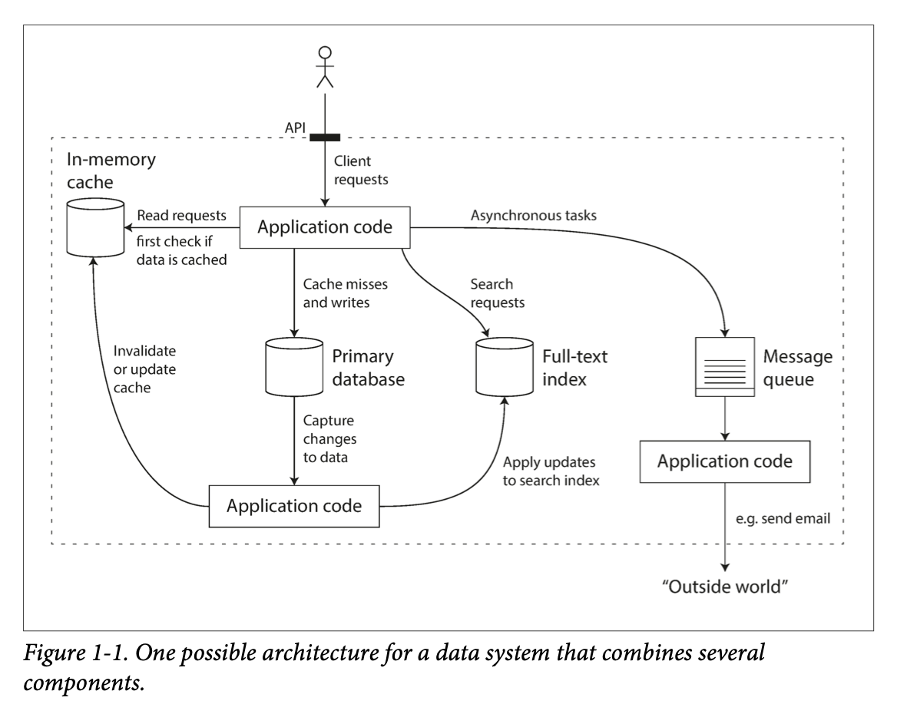
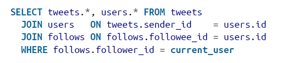
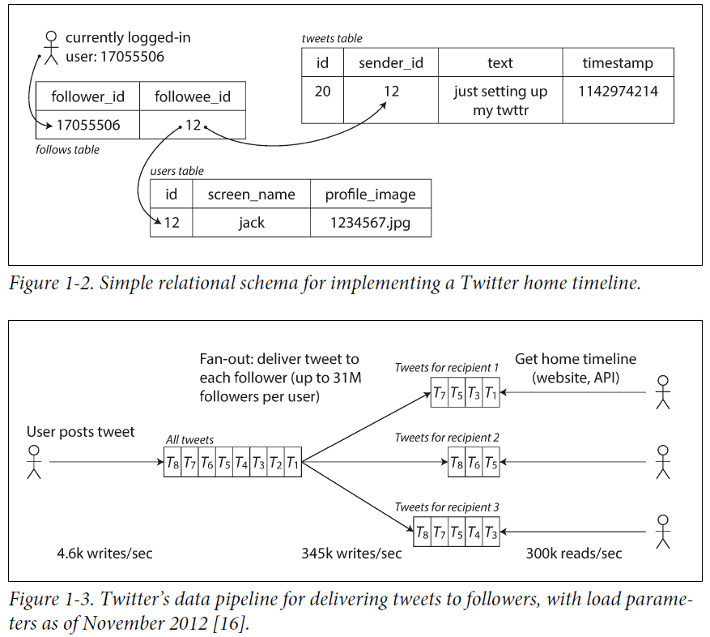
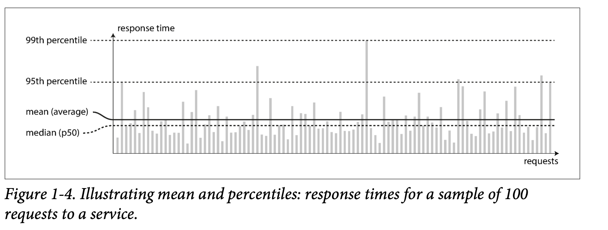
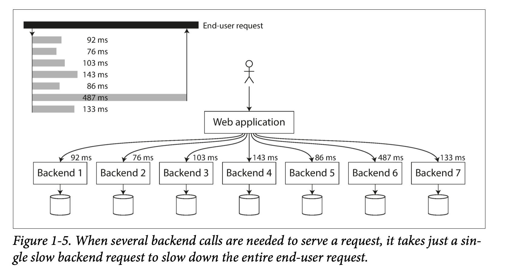

# Designing Data Intensive Applications

## Chapter 1 - Reliable, Scalable, and Maintainable Applications

* Many applications today are data-intensive, as opposed to compute-intensive. Raw CPU power is rarely a limiting factor for these applications—bigger problems are usually the amount of data, the complexity of data, and the speed at which it is changing.

* A data-intensive application is typically built from standard building blocks that provide commonly needed functionality. For example, many applications need to:
    * Store data so that they, or another application, can find it again later (databases)
    * Remember the result of an expensive operation, to speed up reads (caches)
    * Allow users to search data by keyword or filter it in various ways (search indexes)
    * Send a message to another process, to be handled asynchronously (stream processing)
    * Periodically crunch a large amount of accumulated data (batch processing)

* 

* Reliability
    * The system should continue to work correctly (performing the correct function at the desired level of performance) even in the face of adversity (hardware or software faults, and even human error). See “Reliability” on page 6.
* Scalability
    * As the system grows (in data volume, traffic volume, or complexity), there should be reasonable ways of dealing with that growth. See “Scalability” on page 10.
* Maintainability
    * Over time, many different people will work on the system (engineering and operations, both maintaining current behavior and adapting the system to new use cases), and they should all be able to work on it productively. See “Maintainability” on page 18.

* Hardware Faults
    * Hard disks are reported as having a mean time to failure (MTTF) of about 10 to 50 years [5, 6]. Thus, on a storage cluster with 10,000 disks, we should expect on average one disk to die per day.

* Software Errors
    * A software bug that causes every instance of an application server to crash when given a particular bad input. For example, consider the leap second on June 30, 2012, that caused many applications to hang simultaneously due to a bug in the Linux kernel [9].
    * A runaway process that uses up some shared resource—CPU time, memory, disk space, or network bandwidth.
    * A service that the system depends on that slows down, becomes unresponsive, or starts returning corrupted responses.
    * Cascading failures, where a small fault in one component triggers a fault in another component, which in turn triggers further faults [10].

* Human Errors
    * Humans design and build software systems, and the operators who keep the systems running are also human. Even when they have the best intentions, humans are known to be unreliable. For example, one study of large internet services found that configuration errors by operators were the leading cause of outages, whereas hardware faults (servers or network) played a role in only 10–25% of outages [13].

* Describing Load
    * First, we need to succinctly describe the current load on the system; only then can we discuss growth questions (what happens if our load doubles?). Load can be described with a few numbers which we call load parameters. The best choice of parameters depends on the architecture of your system: it may be requests per second to a web server, the ratio of reads to writes in a database, the number of simultaneously active users in a chat room, the hit rate on a cache, or something else. Perhaps the average case is what matters for you, or perhaps your bottleneck is dominated by a small number of extreme cases.

    * Twitter usecase
        * Post a tweet
            * A user can publish a new message to their followers (`4.6k requests/sec` on average, over `12k requests/sec` at peak).
        * Home timeline
            * A user can view tweets posted by the people they follow (`300k requests/sec`).

        * Simply handling `12,000 writes per second` (the peak rate for posting tweets) would be fairly easy. However, Twitter’s scaling challenge is not primarily due to `tweet volume`, but due to **fan-out** — each user follows many people, and each user is followed by many people. There are broadly two ways of implementing these two operations:
            * `fan-out`: In transaction processing systems, we use it to describe the number of requests to other services that we need to make in order to serve one incoming request.
        
        * Posting a tweet simply inserts the new tweet into a global collection of tweets. When a user requests their home timeline, look up all the people they follow, find all the tweets for each of those users, and merge them (sorted by time). In a relational database like in Figure 1-2, you could write a query such as:

        *   

        * **Maintain a cache for each user’s home timeline** like a mailbox of tweets for each recipient user (see Figure 1-3). When a user posts a tweet, look up all the people who follow that user, and insert the new tweet into each of their home timeline caches. The request to read the home timeline is then cheap, because its result has been computed ahead of time.

        *   

        * The first version of `Twitter` used `approach 1`, but the systems struggled to keep up with the load of home timeline queries, so the company switched to `approach 2`. This works better because **the average rate of published tweets is almost two orders of magnitude lower than the rate of home timeline reads**, and so in this case it’s preferable **to do more work at write time and less at read time**.

        * However, the downside of `approach 2` is that posting a tweet now requires a lot of extra work. On average, a tweet is delivered to about `75 followers`, so `4.6k tweets per second become 345k` writes per second to the home timeline caches. But this average hides the fact that the **number of followers per user varies wildly**, and some users have over `30 million followers`. This means that a single tweet may result in over `30 million` writes to home timelines! Doing this in a timely manner—Twitter tries to deliver tweets to followers within five seconds — is a significant challenge.

        * The final twist of the `Twitter` anecdote: now that `approach 2` is robustly implemented, Twitter is moving to a `hybrid` of both approaches. Most users’ tweets continue to be fanned out to home timelines at the time when they are posted, but a small number of users with a very large number of followers (i.e., celebrities) are excepted from this `fan-out`.

* Describing Performance
    * Once you have described the load on your system, you can investigate what happens when the load increases. You can look at it in two ways:

        * When you increase a load parameter and keep the system resources (CPU, memory, network bandwidth, etc.) unchanged, **how is the performance of your system affected**?
        * When you increase a load parameter, how much do you need to **increase the resources** if you want to keep performance unchanged?
    
    * In a batch processing system such as Hadoop, we usually care about **throughput the number of records we can process per second**, or the total time it takes to run a job on a dataset of a certain size.iii In online systems, what’s usually more important is the service’s **response time—that** is, the time between a client sending a request and receiving a response.
        * iii. In an ideal world, the running time of a batch job is the size of the dataset divided by the throughput. In practice, the running time is often longer, due to skew (data not being spread evenly across worker processes) and needing to wait for the slowest task to complete.
    
    * **Latency and response time are often used synonymously, but they are not the same.** The response time is what the client sees: besides the actual time to process the request (the service time), it includes network delays and queueing delays. Latency is the duration that a request is `waiting to be handled` during which it is latent, await‐ ing service.

    * Even if you only make the same request over and over again, you’ll get a slightly dif‐ ferent response time on every try. **In practice, in a system handling a variety of requests, the response time can vary a lot. We therefore need to think of response time not as a single number, but as a distribution of values that you can measure.**

    * 
        * The median is the middle number in a sorted, ascending or descending, list of numbers and can be more descriptive of that data set than the average. The median is sometimes used as opposed to the mean when there are outliers in the sequence that might skew the average of the values.
    
    * It’s common to see the average response time of a service reported. (Strictly speaking, the term “average” doesn’t refer to any particular formula, but in practice it is usually understood as the arithmetic mean: given n values, add up all the values, and divide by n.) **However, the mean is not a very good metric if you want to know your “typical” response time, because it doesn’t tell you how many users actually experienced that delay.**

    * **Usually it is better to use percentiles. If you take your list of response times and sort it from fastest to slowest, then the median is the halfway point: for example, if your median response time is 200 ms, that means half your requests return in less than 200 ms, and half your requests take longer than that.**

    * The **median** is also known as the 50th percentile, and sometimes abbreviated as **p50**. 

    * In order to figure out how bad your outliers are, you can look at higher percentiles: the `95th`, `99th`, and `99.9th` percentiles are common (abbreviated `p95`, `p99`, and `p999`). They are the response time thresholds at which 95%, 99%, or 99.9% of requests are faster than that particular threshold. For example, if the `95th` percentile response time is 1.5 seconds, that means `95 out of 100 requests take less than 1.5 seconds`, and 5 out of 100 requests take 1.5 seconds or more.

    * High percentiles of response times, also known as tail latencies, are important because they directly affect users’ experience of the service. For example, Amazon describes response time requirements for internal services in terms of the 99.9th per‐ centile, even though it only affects 1 in 1,000 requests. This is because the customers with the slowest requests are often those who have the most data on their accounts because they have made many purchases.
        * That is, they’re the most valuable customers [19]. It’s important to keep those customers happy by ensuring the website is fast for them: Amazon has also observed that a 100 ms increase in response time reduces sales by 1% [20], and others report that a 1-second slowdown reduces a customer sat‐ isfaction metric by 16%
    
    * For example, percentiles are often used in `service level objectives (SLOs)` and `service level agreements (SLAs)`, contracts that define the expected performance and availability of a service. An `SLA` may state that the service is considered to be up if it has a `median response time of less than 200 ms` and a `99th percentile under 1 s` (if the response time is longer, it might as well be down), and the service may be required to be up at least 99.9% of the time. These metrics set expectations for clients of the ser‐ vice and allow customers to demand a refund if the SLA is not met.

    * **Queueing delays** often account for a large part of the `response time` at `high percentiles`. As a server can only process a `small number of things in parallel` (limited, for example, by its **number of CPU cores**), **it only takes a small number of slow requests to hold up the processing of subsequent requests an effect** sometimes known as `head-of-line blocking`. Even if those subsequent requests are fast to process on the server, the client will see a slow overall response time due to the time waiting for the prior request to complete. Due to this effect, it is important to measure response times on the client side.

    * 

* Approaches for Coping with Load
    * how do we maintain good performance even when our load parameters increase by some amount?

    * People often talk of a dichotomy between `scaling up` (vertical scaling, moving to a more powerful machine) and `scaling out` (horizontal scaling, distributing the load across multiple smaller machines). Distributing load across multiple machines is also known as a shared-nothing architecture. A system that can run on a single machine is often simpler, but high-end machines can become very expensive, so very intensive workloads often can’t avoid scaling out. In reality, good architectures usually involve a pragmatic mixture of approaches: for example, using several fairly powerful machines can still be simpler and cheaper than a large number of small virtual machines.

    * While distributing stateless services across multiple machines is fairly straightforward, taking stateful data systems from a single node to a distributed setup can intro‐ duce a lot of additional complexity. For this reason, common wisdom until recently was to keep your database on a single node (scale up) until scaling cost or high- availability requirements forced you to make it distributed.

    * **As the tools and abstractions for distributed systems get better, this common wisdom may change, at least for some kinds of applications. It is conceivable that distributed data systems will become the default in the future, even for use cases that don’t handle large volumes of data or traffic.** 

    * The architecture of systems that operate at large scale is usually **highly specific to the application there is no such thing as a generic, one-size-fits-all scalable architecture** (informally known as magic scaling sauce). The problem may be the `volume of reads`, the `volume of writes`, the `volume of data to store`, the `complexity of the data`, the `response time requirements`, the `access patterns`, or (usually) some mixture of all of these plus many more issues.

* Maintainability
    * It is well known that the **majority of the cost of software is not in its initial development, but in its ongoing maintenance—fixing bugs**, keeping its systems operational, investigating failures, adapting it to new platforms, modifying it for new use cases, repaying technical debt, and adding new features.

    * Operability
        * Make it easy for operations teams to keep the system running smoothly.
    * Simplicity
        * Make it easy for new engineers to understand the system, by removing as much complexity as possible from the system. (Note this is not the same as simplicity of the user interface.)
    * Evolvability
        * Make it easy for engineers to make changes to the system in the future, adapting it for unanticipated use cases as requirements change. Also known as **extensibility, modifiability, or plasticity.**

* Operability: Making Life Easy for Operations

    * Operations teams are vital to keeping a software system running smoothly. A good operations team typically is responsible for the following, and more [29]:

        * Monitoring the health of the system and quickly **restoring service** if it goes into a bad state
        * **Tracking down the cause of problems**, such as system failures or degraded performance
        * Keeping software and **platforms up to date**, including security patches
        * Keeping tabs on **how different systems affect each other**, so that a problematic change can be avoided before it causes damage
        * **Anticipating future problems** and solving them before they occur (e.g., **capacity planning**)
        * Establishing good practices and **tools for deployment**, configuration management, and more
        * Performing complex maintenance tasks, such as **moving an application from one platform to another**
        * Maintaining the **security of the system** as configuration changes are made
        * Defining processes that make operations predictable and help keep the production environment stable
        * Preserving the organization’s knowledge about the system, even as individual people come and go
    
    * Data systems can do various things to make routine tasks easy, including:
        * Providing **visibility into the runtime behavior** and internals of the system, with good monitoring
        * Providing **good support for automation and integration** with standard tools
        * **Avoiding dependency on individual machines** (allowing machines to be taken down for maintenance while the system as a whole continues running uninterrupted)
        * Providing **good documentation** and an easy-to-understand operational model (“If I do X, Y will happen”)
        * Providing **good default behavior**, but also giving administrators the freedom to override defaults when needed
        * **Self-healing where appropriate**, but also giving administrators manual control over the system state when needed
        * Exhibiting **predictable behavior**, minimizing surprises

* Simplicity: Managing Complexity
    * Small software projects can have delightfully simple and expressive code, but as projects get larger, they often become very complex and difficult to understand. This complexity slows down everyone who needs to work on the system, further increasing the cost of maintenance. A software project mired in complexity is sometimes described as a big ball of mud [30].

    * There are various possible symptoms of complexity: explosion of the state space, tight coupling of modules, tangled dependencies, inconsistent naming and terminology, hacks aimed at solving performance problems, special-casing to work around issues elsewhere, and many more. Much has been said on this topic already [31, 32, 33].

    * **One of the best tools we have for removing accidental complexity is abstraction. A good abstraction can hide a great deal of implementation detail behind a clean, simple-to-understand façade.**
        * For example, high-level programming languages are abstractions that hide machine code, CPU registers, and syscalls. SQL is an abstraction that hides complex on-disk and in-memory data structures, concurrent requests from other clients, and inconsistencies after crashes.

* Evolvability: Making Change Easy
    * It’s extremely unlikely that your system’s requirements will remain unchanged for‐ ever. They are much more likely to be in constant flux: you learn new facts, previously unanticipated use cases emerge, business priorities change, users request new features, new platforms replace old platforms, legal or regulatory requirements change, growth of the system forces architectural changes, etc.

    * **The Agile community has also developed technical tools and pat‐ terns that are helpful when developing software in a frequently changing environment, such as test-driven development (TDD) and refactoring.**

## Chapter 2 - Data Models and Query Languages