# Designing Data Intensive Applications

## Chapter 1 - Reliable, Scalable, and Maintainable Applications

* Many applications today are data-intensive, as opposed to compute-intensive. Raw CPU power is rarely a limiting factor for these applications—bigger problems are usually the amount of data, the complexity of data, and the speed at which it is changing.

* A data-intensive application is typically built from standard building blocks that provide commonly needed functionality. For example, many applications need to:
    * Store data so that they, or another application, can find it again later (databases)
    * Remember the result of an expensive operation, to speed up reads (caches)
    * Allow users to search data by keyword or filter it in various ways (search indexes)
    * Send a message to another process, to be handled asynchronously (stream processing)
    * Periodically crunch a large amount of accumulated data (batch processing)

* 

* Reliability
    * The system should continue to work correctly (performing the correct function at the desired level of performance) even in the face of adversity (hardware or software faults, and even human error). See “Reliability” on page 6.
* Scalability
    * As the system grows (in data volume, traffic volume, or complexity), there should be reasonable ways of dealing with that growth. See “Scalability” on page 10.
* Maintainability
    * Over time, many different people will work on the system (engineering and operations, both maintaining current behavior and adapting the system to new use cases), and they should all be able to work on it productively. See “Maintainability” on page 18.

* Hardware Faults
    * Hard disks are reported as having a mean time to failure (MTTF) of about 10 to 50 years [5, 6]. Thus, on a storage cluster with 10,000 disks, we should expect on average one disk to die per day.

* Software Errors
    * A software bug that causes every instance of an application server to crash when given a particular bad input. For example, consider the leap second on June 30, 2012, that caused many applications to hang simultaneously due to a bug in the Linux kernel [9].
    * A runaway process that uses up some shared resource—CPU time, memory, disk space, or network bandwidth.
    * A service that the system depends on that slows down, becomes unresponsive, or starts returning corrupted responses.
    * Cascading failures, where a small fault in one component triggers a fault in another component, which in turn triggers further faults [10].

* Human Errors
    * Humans design and build software systems, and the operators who keep the systems running are also human. Even when they have the best intentions, humans are known to be unreliable. For example, one study of large internet services found that configuration errors by operators were the leading cause of outages, whereas hardware faults (servers or network) played a role in only 10–25% of outages [13].

* Describing Load
    * First, we need to succinctly describe the current load on the system; only then can we discuss growth questions (what happens if our load doubles?). Load can be described with a few numbers which we call load parameters. The best choice of parameters depends on the architecture of your system: it may be requests per second to a web server, the ratio of reads to writes in a database, the number of simultaneously active users in a chat room, the hit rate on a cache, or something else. Perhaps the average case is what matters for you, or perhaps your bottleneck is dominated by a small number of extreme cases.

    * Twitter usecase
        * Post a tweet
            * A user can publish a new message to their followers (`4.6k requests/sec` on average, over `12k requests/sec` at peak).
        * Home timeline
            * A user can view tweets posted by the people they follow (`300k requests/sec`).

        * Simply handling `12,000 writes per second` (the peak rate for posting tweets) would be fairly easy. However, Twitter’s scaling challenge is not primarily due to `tweet volume`, but due to **fan-out** — each user follows many people, and each user is followed by many people. There are broadly two ways of implementing these two operations:
            * `fan-out`: In transaction processing systems, we use it to describe the number of requests to other services that we need to make in order to serve one incoming request.
        
        * Posting a tweet simply inserts the new tweet into a global collection of tweets. When a user requests their home timeline, look up all the people they follow, find all the tweets for each of those users, and merge them (sorted by time). In a relational database like in Figure 1-2, you could write a query such as:

        *   

        * **Maintain a cache for each user’s home timeline** like a mailbox of tweets for each recipient user (see Figure 1-3). When a user posts a tweet, look up all the people who follow that user, and insert the new tweet into each of their home timeline caches. The request to read the home timeline is then cheap, because its result has been computed ahead of time.

        *   

        * The first version of `Twitter` used `approach 1`, but the systems struggled to keep up with the load of home timeline queries, so the company switched to `approach 2`. This works better because **the average rate of published tweets is almost two orders of magnitude lower than the rate of home timeline reads**, and so in this case it’s preferable **to do more work at write time and less at read time**.

        * However, the downside of `approach 2` is that posting a tweet now requires a lot of extra work. On average, a tweet is delivered to about `75 followers`, so `4.6k tweets per second become 345k` writes per second to the home timeline caches. But this average hides the fact that the **number of followers per user varies wildly**, and some users have over `30 million followers`. This means that a single tweet may result in over `30 million` writes to home timelines! Doing this in a timely manner—Twitter tries to deliver tweets to followers within five seconds — is a significant challenge.

        * The final twist of the `Twitter` anecdote: now that `approach 2` is robustly implemented, Twitter is moving to a `hybrid` of both approaches. Most users’ tweets continue to be fanned out to home timelines at the time when they are posted, but a small number of users with a very large number of followers (i.e., celebrities) are excepted from this `fan-out`.

* Describing Performance
    * Once you have described the load on your system, you can investigate what happens when the load increases. You can look at it in two ways:

        * When you increase a load parameter and keep the system resources (CPU, memory, network bandwidth, etc.) unchanged, **how is the performance of your system affected**?
        * When you increase a load parameter, how much do you need to **increase the resources** if you want to keep performance unchanged?
    
    * In a batch processing system such as Hadoop, we usually care about **throughput the number of records we can process per second**, or the total time it takes to run a job on a dataset of a certain size.iii In online systems, what’s usually more important is the service’s **response time—that** is, the time between a client sending a request and receiving a response.
        * iii. In an ideal world, the running time of a batch job is the size of the dataset divided by the throughput. In practice, the running time is often longer, due to skew (data not being spread evenly across worker processes) and needing to wait for the slowest task to complete.
    
    * **Latency and response time are often used synonymously, but they are not the same.** The response time is what the client sees: besides the actual time to process the request (the service time), it includes network delays and queueing delays. Latency is the duration that a request is `waiting to be handled` during which it is latent, await‐ ing service.

    * Even if you only make the same request over and over again, you’ll get a slightly dif‐ ferent response time on every try. **In practice, in a system handling a variety of requests, the response time can vary a lot. We therefore need to think of response time not as a single number, but as a distribution of values that you can measure.**

    * 
        * The median is the middle number in a sorted, ascending or descending, list of numbers and can be more descriptive of that data set than the average. The median is sometimes used as opposed to the mean when there are outliers in the sequence that might skew the average of the values.
    
    * It’s common to see the average response time of a service reported. (Strictly speaking, the term “average” doesn’t refer to any particular formula, but in practice it is usually understood as the arithmetic mean: given n values, add up all the values, and divide by n.) **However, the mean is not a very good metric if you want to know your “typical” response time, because it doesn’t tell you how many users actually experienced that delay.**

    * **Usually it is better to use percentiles. If you take your list of response times and sort it from fastest to slowest, then the median is the halfway point: for example, if your median response time is 200 ms, that means half your requests return in less than 200 ms, and half your requests take longer than that.**

    * The **median** is also known as the 50th percentile, and sometimes abbreviated as **p50**. 

    * In order to figure out how bad your outliers are, you can look at higher percentiles: the `95th`, `99th`, and `99.9th` percentiles are common (abbreviated `p95`, `p99`, and `p999`). They are the response time thresholds at which 95%, 99%, or 99.9% of requests are faster than that particular threshold. For example, if the `95th` percentile response time is 1.5 seconds, that means `95 out of 100 requests take less than 1.5 seconds`, and 5 out of 100 requests take 1.5 seconds or more.

    * High percentiles of response times, also known as tail latencies, are important because they directly affect users’ experience of the service. For example, Amazon describes response time requirements for internal services in terms of the 99.9th per‐ centile, even though it only affects 1 in 1,000 requests. This is because the customers with the slowest requests are often those who have the most data on their accounts because they have made many purchases.
        * That is, they’re the most valuable customers [19]. It’s important to keep those customers happy by ensuring the website is fast for them: Amazon has also observed that a 100 ms increase in response time reduces sales by 1% [20], and others report that a 1-second slowdown reduces a customer sat‐ isfaction metric by 16%
    
    * For example, percentiles are often used in `service level objectives (SLOs)` and `service level agreements (SLAs)`, contracts that define the expected performance and availability of a service. An `SLA` may state that the service is considered to be up if it has a `median response time of less than 200 ms` and a `99th percentile under 1 s` (if the response time is longer, it might as well be down), and the service may be required to be up at least 99.9% of the time. These metrics set expectations for clients of the ser‐ vice and allow customers to demand a refund if the SLA is not met.

    * **Queueing delays** often account for a large part of the `response time` at `high percentiles`. As a server can only process a `small number of things in parallel` (limited, for example, by its **number of CPU cores**), **it only takes a small number of slow requests to hold up the processing of subsequent requests an effect** sometimes known as `head-of-line blocking`. Even if those subsequent requests are fast to process on the server, the client will see a slow overall response time due to the time waiting for the prior request to complete. Due to this effect, it is important to measure response times on the client side.

    * 

* Approaches for Coping with Load
    * how do we maintain good performance even when our load parameters increase by some amount?

    * People often talk of a dichotomy between `scaling up` (vertical scaling, moving to a more powerful machine) and `scaling out` (horizontal scaling, distributing the load across multiple smaller machines). Distributing load across multiple machines is also known as a shared-nothing architecture. A system that can run on a single machine is often simpler, but high-end machines can become very expensive, so very intensive workloads often can’t avoid scaling out. In reality, good architectures usually involve a pragmatic mixture of approaches: for example, using several fairly powerful machines can still be simpler and cheaper than a large number of small virtual machines.

    * While distributing stateless services across multiple machines is fairly straightforward, taking stateful data systems from a single node to a distributed setup can intro‐ duce a lot of additional complexity. For this reason, common wisdom until recently was to keep your database on a single node (scale up) until scaling cost or high- availability requirements forced you to make it distributed.

    * **As the tools and abstractions for distributed systems get better, this common wisdom may change, at least for some kinds of applications. It is conceivable that distributed data systems will become the default in the future, even for use cases that don’t handle large volumes of data or traffic.** 

    * The architecture of systems that operate at large scale is usually **highly specific to the application there is no such thing as a generic, one-size-fits-all scalable architecture** (informally known as magic scaling sauce). The problem may be the `volume of reads`, the `volume of writes`, the `volume of data to store`, the `complexity of the data`, the `response time requirements`, the `access patterns`, or (usually) some mixture of all of these plus many more issues.

* Maintainability
    * It is well known that the **majority of the cost of software is not in its initial development, but in its ongoing maintenance—fixing bugs**, keeping its systems operational, investigating failures, adapting it to new platforms, modifying it for new use cases, repaying technical debt, and adding new features.

    * Operability
        * Make it easy for operations teams to keep the system running smoothly.
    * Simplicity
        * Make it easy for new engineers to understand the system, by removing as much complexity as possible from the system. (Note this is not the same as simplicity of the user interface.)
    * Evolvability
        * Make it easy for engineers to make changes to the system in the future, adapting it for unanticipated use cases as requirements change. Also known as **extensibility, modifiability, or plasticity.**

* Operability: Making Life Easy for Operations

    * Operations teams are vital to keeping a software system running smoothly. A good operations team typically is responsible for the following, and more [29]:

        * Monitoring the health of the system and quickly **restoring service** if it goes into a bad state
        * **Tracking down the cause of problems**, such as system failures or degraded performance
        * Keeping software and **platforms up to date**, including security patches
        * Keeping tabs on **how different systems affect each other**, so that a problematic change can be avoided before it causes damage
        * **Anticipating future problems** and solving them before they occur (e.g., **capacity planning**)
        * Establishing good practices and **tools for deployment**, configuration management, and more
        * Performing complex maintenance tasks, such as **moving an application from one platform to another**
        * Maintaining the **security of the system** as configuration changes are made
        * Defining processes that make operations predictable and help keep the production environment stable
        * Preserving the organization’s knowledge about the system, even as individual people come and go
    
    * Data systems can do various things to make routine tasks easy, including:
        * Providing **visibility into the runtime behavior** and internals of the system, with good monitoring
        * Providing **good support for automation and integration** with standard tools
        * **Avoiding dependency on individual machines** (allowing machines to be taken down for maintenance while the system as a whole continues running uninterrupted)
        * Providing **good documentation** and an easy-to-understand operational model (“If I do X, Y will happen”)
        * Providing **good default behavior**, but also giving administrators the freedom to override defaults when needed
        * **Self-healing where appropriate**, but also giving administrators manual control over the system state when needed
        * Exhibiting **predictable behavior**, minimizing surprises

* Simplicity: Managing Complexity
    * Small software projects can have delightfully simple and expressive code, but as projects get larger, they often become very complex and difficult to understand. This complexity slows down everyone who needs to work on the system, further increasing the cost of maintenance. A software project mired in complexity is sometimes described as a big ball of mud [30].

    * There are various possible symptoms of complexity: explosion of the state space, tight coupling of modules, tangled dependencies, inconsistent naming and terminology, hacks aimed at solving performance problems, special-casing to work around issues elsewhere, and many more. Much has been said on this topic already [31, 32, 33].

    * **One of the best tools we have for removing accidental complexity is abstraction. A good abstraction can hide a great deal of implementation detail behind a clean, simple-to-understand façade.**
        * For example, high-level programming languages are abstractions that hide machine code, CPU registers, and syscalls. SQL is an abstraction that hides complex on-disk and in-memory data structures, concurrent requests from other clients, and inconsistencies after crashes.

* Evolvability: Making Change Easy
    * It’s extremely unlikely that your system’s requirements will remain unchanged for‐ ever. They are much more likely to be in constant flux: you learn new facts, previously unanticipated use cases emerge, business priorities change, users request new features, new platforms replace old platforms, legal or regulatory requirements change, growth of the system forces architectural changes, etc.

    * **The Agile community has also developed technical tools and pat‐ terns that are helpful when developing software in a frequently changing environment, such as test-driven development (TDD) and refactoring.**

## Chapter 2 - Data Models and Query Languages

* Data models are perhaps the most important part of developing software, because they have such a profound effect: not only on how the software is written, but also on how we think about the problem that we are solving.

* In this chapter we will look at a range of general-purpose data models for data stor‐ age and querying (point 2 in the preceding list). In particular, we will compare the relational model, the document model, and a few graph-based data models. We will also look at various query languages and compare their use cases. In Chapter 3 we will discuss how storage engines work; that is, how these data models are actually implemented (point 3 in the list).

### Relational Model Versus Document Model
* The best-known data model today is probably that of SQL, based on the relational model proposed by Edgar Codd in 1970 [1]: data is organized into relations (called tables in SQL), where each relation is an unordered collection of tuples (rows in SQL).

* The roots of relational databases lie in business data processing, which was performed on mainframe computers in the 1960s and ’70s. The use cases appear mundane from today’s perspective: typically transaction processing (entering sales or banking trans‐ actions, airline reservations, stock-keeping in warehouses) and batch processing (cus‐ tomer invoicing, payroll, reporting).

* **Over the years, there have been many competing approaches to data storage and querying. In the 1970s and early 1980s, the `network model` and the `hierarchical model` were the main alternatives, but the relational model came to dominate them.** Object databases came and went again in the late 1980s and early 1990s. XML databases appeared in the early 2000s, but have only seen niche adoption. Each competitor to the relational model generated a lot of hype in its time, but it never lasted [2].

### The Birth of NoSQL

* Now, in the 2010s, NoSQL is the latest attempt to overthrow the relational model’s dominance. The name “NoSQL” is unfortunate, since it doesn’t actually refer to any particular technology—it was originally intended simply as a catchy Twitter hashtag for a meetup on open source, distributed, nonrelational databases in 2009.

* There are several driving forces behind the adoption of NoSQL databases, including:

    * A need for **greater scalability than relational databases** can easily achieve, including very large datasets or **very high write throughput**
    * A widespread preference for free and open source software over commercial database products
    * Specialized query operations that are not well supported by the relational model
    * Frustration with the restrictiveness of relational schemas, and a desire for a more dynamic and expressive data model [5]

* Different applications have different requirements, and the best choice of technology for one use case may well be different from the best choice for another use case. It therefore seems likely that in the foreseeable future, relational databases will continue to be used alongside a broad variety of nonrelational datastores—an idea that is sometimes called **polyglot persistence** [3].

### The Object-Relational Mismatch

* Most application development today is done in object-oriented programming languages, which leads to a common criticism of the SQL data model: if data is stored in relational tables, an `awkward translation layer` is required between the objects in the application code and the database model of tables, rows, and columns. The disconnect between the models is sometimes called an **impedance mismatch**.

    * `Object-relational mapping (ORM)` frameworks like ActiveRecord and Hibernate reduce the amount of boilerplate code required for this translation layer, but they can’t completely hide the differences between the two models.

* 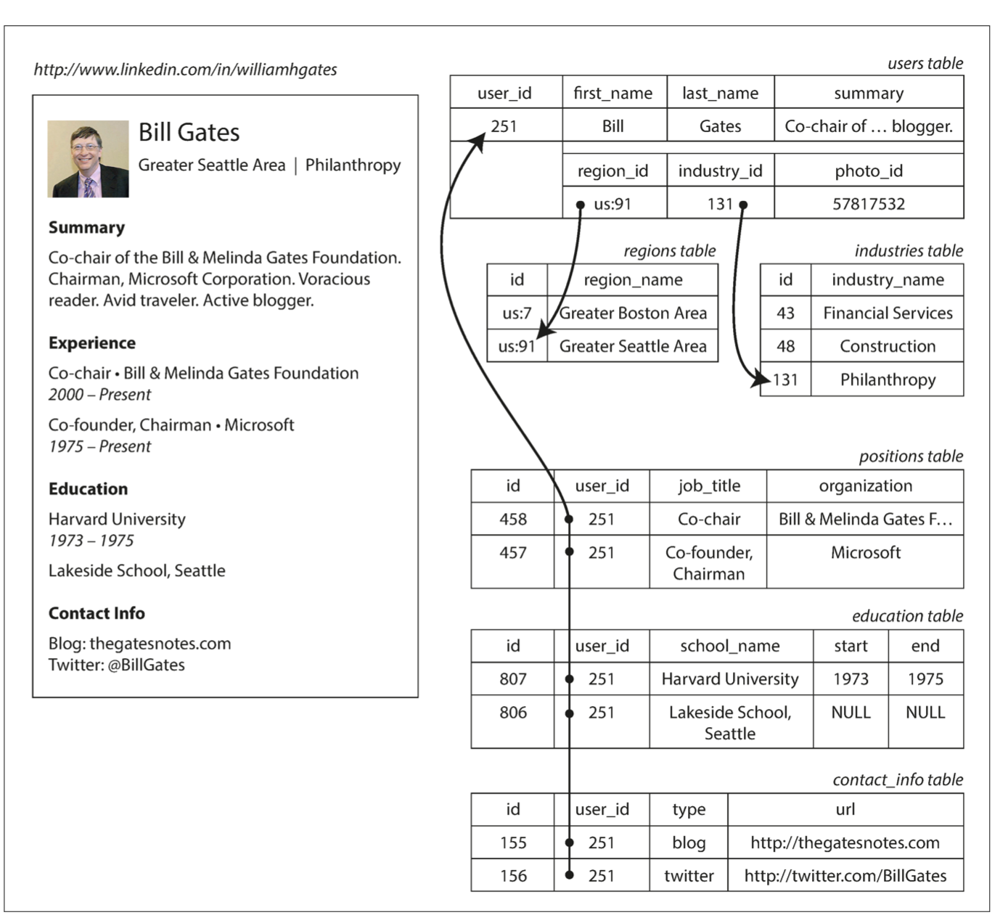 

* In the traditional SQL model (prior to SQL:1999), the `most common normalized representation` is to put positions, education, and contact information in separate tables, with a foreign key reference to the users table, as in Figure 2-1.

* Later versions of the SQL standard added support for `structured datatypes and XML data`; this allowed multi-valued data to be stored within a single row, with support for querying and indexing inside those documents. These features are supported to varying degrees by `Oracle, IBM DB2, MS SQL Server, and PostgreSQL` [6, 7]. A **JSON datatype is also supported by several databases**, including IBM DB2, MySQL, and PostgreSQL [8].

* A third option is to encode jobs, education, and contact info as a `JSON or XML` document, store it on a text column in the database, and let the application inter‐ pret its structure and content. In this setup, you typically cannot use the database to query for values inside that encoded column.

* For a data structure like a résumé, which is mostly a self-contained document, a JSON representation can be quite appropriate: see Example 2-1. `JSON` has the appeal of being much simpler than `XML`. **Document-oriented databases like MongoDB [9], RethinkDB [10], CouchDB [11], and Espresso [12] support this data model**.
    * Some developers feel that the `JSON` model reduces the **impedance mismatch** between the application code and the storage layer. However, as we shall see in Chapter 4, there are also problems with JSON as a data encoding format. The lack of a schema is often cited as an advantage; we will discuss this in “Schema flexibility in the document model” on page 39.
    * The `JSON` representation has **better locality than the multi-table schema** in Figure 2-1. If you want to fetch a profile in the relational example, you need to either perform multiple queries (query each table by user_id) or perform a messy multi- way join between the users table and its subordinate tables. In the **JSON representation, all the relevant information is in one place, and one query is sufficient.**

### Many-to-One and Many-to-Many Relationships

* If the user interface has free-text fields for entering the region and the industry, it makes sense to store them as plain-text strings. But there are advantages to having standardized lists of geographic regions and industries, and letting users choose from a drop-down list or autocompleter:
    * Consistent style and spelling across profiles
    * **Avoiding ambiguity** (e.g., if there are several cities with the same name)
    * **Ease of updating** —the name is stored in only one place, so it is easy to update across the board if it ever needs to be changed (e.g., change of a city name due to political events)
    * **Localization support** —when the site is translated into other languages, the standardized lists can be localized, so the region and industry can be displayed in the viewer’s language
    * **Better search** —e.g., a search for philanthropists in the state of Washington can match this profile, because the list of regions can encode the fact that Seattle is in Washington (which is not apparent from the string "Greater Seattle Area")

* The advantage of using an ID is that because it has no meaning to humans, it never needs to change: the ID can remain the same, even if the information it identifies changes. Anything that is meaningful to humans may need to change sometime in the future—and if that information is duplicated, all the redundant copies need to be updated. That incurs write overheads, and risks inconsistencies (where some copies of the information are updated but others aren’t).**Removing such duplication is the key idea behind normalization in databases.ii**

* **If the database itself does not support joins, you have to emulate a join in application code by making multiple queries to the database.** (In this case, the lists of regions and industries are probably small and slow-changing enough that the application can simply keep them in memory. But nevertheless, the work of making the join is shifted from the database to the application code.)

### Are Document Databases Repeating History?

* While many-to-many relationships and joins are routinely used in relational data‐ bases, document databases and NoSQL reopened the debate on how best to represent such relationships in a database. **This debate is much older than NoSQL—in fact, it goes back to the very earliest computerized database systems.

* The most popular database for business data processing in the 1970s was IBM’s `Information Management System (IMS)`, originally developed for `stock-keeping (SKU)` in the Apollo space program and first `commercially released in 1968` [13]. It is still in use and maintained today, `running on OS/390 on IBM mainframes` [14].
    * A `stock-keeping unit (SKU)` is a scannable bar code, most often seen printed on product labels in a retail store. The label allows vendors to automatically track the movement of inventory. The SKU is composed of an alphanumeric combination of eight-or-so characters. The characters are a code that track the price, product details, and the manufacturer. SKUs may also be applied to intangible but billable products, such as units of repair time in an auto body shop or warranties.
    *  When a customer buys an item at the `point-of-sale (POS)`, the `SKU` is scanned and the `POS system automatically removes the item from the inventory` as well as recording other data such as the sale price. SKUs should not be confused with model numbers, although businesses may embed model numbers within SKUs.

* The design of `IMS` used a fairly simple data model called the **`hierarchical model`**, which has some remarkable similarities to the **`JSON model`** used by document databases [2]. It represented all data as a `tree of records nested within records`, much like the `JSON structure` of Figure 2-2.

* Like `document databases`, `IMS` worked well for `one-to-many relationships`, but it **`made many-to-many relationships difficult`**, and it didn’t **support joins**. Developers had to decide whether to duplicate (denormalize) data or to manually resolve references from one record to another. These problems of the `1960s` and `70s` were very much like the problems that developers are running into with `document databases today` [15].

* Various solutions were proposed to solve the limitations of the hierarchical model. The two most prominent were the `relational model (which became SQL, and took over the world)` and the `network model (which initially had a large following but eventually faded into obscurity)`. The “great debate” between these two camps lasted for much of the 1970s [2]. 

### The network model

* The `network model` was standardized by a committee called the `Conference on Data Systems Languages (CODASYL)` and implemented by several different database vendors; it is also known as the `CODASYL` model [16].

* The `CODASYL` model was a **generalization of the hierarchical model**. In the `tree structure of the hierarchical model`, every record has exactly **one parent**; in the `network model`, a record could have **multiple parents**. For example, there could be one record for the "Greater Seattle Area" region, and every user who lived in that region could be linked to it. **This allowed many-to-one and many-to-many relationships to be modeled.**

* The `links` between records in the `network model` were **not foreign keys**, but more `like pointers in a programming language` (while still being stored on disk). The only way of accessing a record was to `follow a path from a root record along these chains of links`. This was called an **`access path`**.
    * In the simplest case, an `access path` could be like the `traversal of a linked list`: start at the `head of the list`, and look at one record at a time until you find the one you want. But in a world of `many-to-many relationships`, several `different paths can lead to the same record`, and a programmer working with the network model had to keep track of these different `access paths` in their head.

* A query in `CODASYL` was performed by moving a `cursor through the database` by iterating over lists of records and following `access paths`. If a record had `multiple parents` (i.e., multiple incoming pointers from other records), the application code had to keep track of all the `various relationships`. Even `CODASYL` committee members admitted that this was like navigating around an `n-dimensional` data space [17].

* Although `manual access path` selection was able to make the most efficient use of the very limited hardware capabilities in the `1970s` (such as tape drives, whose seeks are extremely slow), the problem was that they made the code for `querying and updating` the database `complicated and inflexible`. With both the `hierarchical and the network model`, if you **didn’t have a path to the data you wanted, you were in a difficult situation**. You could change the `access paths`, but then you had to go through a lot of `handwritten database query code` and rewrite it to handle the new `access paths`. It was difficult to make changes to an application’s data model.

### The relational model

* What the `relational model` did, by contrast, was to lay out all the data in the open: a `relation` (table) is simply a `collection of tuples` (rows), and that’s it. There are no labyrinthine nested structures, no complicated access paths to follow if you want to look at the data. You can read any or all of the rows in a table, selecting those that match an arbitrary condition. You can read a particular row by designating some columns as a key and matching on those. `You can insert a new row into any table without worrying about foreign key relationships to and from other tables`.iv

* In a relational database, the query optimizer automatically decides which parts of the query to execute in which order, and which indexes to use. Those choices are effectively the `“access path,”` but the big difference is that they are **made automatically by the query optimizer**, not by the application developer, so we rarely need to think about them.
    * If you want to query your data in new ways, you can just `declare a new index`, and queries will **automatically** use `whichever indexes are most appropriate`. You don’t need to change your queries to take advantage of a new index. (See also “Query Languages for Data” on page 42.) The relational model thus made it much easier to add new features to applications.
    * But a key insight of the relational model was this: **you only need to build a query optimizer once, and then all applications that use the database can benefit from it**. If you don’t have a query optimizer, it’s easier to handcode the `access paths` for a particular query than to write a general-purpose optimizer—but the general-purpose solution wins in the long run.

### Comparison to document databases

* Document databases reverted back to the hierarchical model in one aspect: storing nested records (one-to-many relationships, like positions, education, and contact_info in Figure 2-1) within their parent record rather than in a separate table.

* However, when it comes to representing `many-to-one` and `many-to-many` relationships, relational and document databases are not fundamentally different: in both cases, the related item is referenced by a unique identifier, which is called a foreign key in the relational model and a document reference in the document model [9]. **That identifier is resolved at read time by using a join or follow-up queries.** To date, document databases have not followed the path of `CODASYL`.

### Relational Versus Document Databases Today

* There are many differences to consider when comparing relational databases to document databases, including their `fault-tolerance` properties (see Chapter 5) and `handling of concurrency` (see Chapter 7). In this chapter, we will concentrate only on the differences in the data model.

* The main arguments in favor of the document data model are `schema flexibility`, **better performance due to locality**, and that for some applications it is closer to the data structures used by the application. The `relational model` counters by providing `better support for joins, and many-to-one and many-to-many relationships`.

* The relational technique of **shredding**— splitting a document-like structure into multiple tables (like positions, education, and contact_info in Figure 2-1)—can lead to cumbersome schemas and unnecessarily complicated application code.

* However, if your application does use `many-to-many` relationships, the document model becomes less appealing. It’s possible to reduce the need for joins by `denormalizing`, but then the application code needs to do additional work to keep the `denormalized` data consistent.

* It’s not possible to say in general which data model leads to simpler application code; it depends on the kinds of relationships that exist between data items. For `highly interconnected data`, `the document model is awkward, the relational model is acceptable, and graph models (see “Graph-Like Data Models” on page 49) are the most natural`.

### Schema flexibility in the document model

* Most document databases, and the JSON support in relational databases, **do not enforce any schema on the data in documents**. XML support in relational databases usually comes with optional schema validation. No schema means that arbitrary keys and values can be added to a document, and when reading, clients have no guarantees as to what fields the documents may contain.

* Document databases are sometimes called `schemaless`, but that’s misleading, as the code that reads the data usually assumes some kind of structure—i.e., there is an `implicit schema`, but it is not enforced by the database [20]. A more accurate term is `schema-on-read` (the structure of the data is implicit, and only interpreted when the data is read), in contrast with `schema-on-write` (the traditional approach of relational databases, where the schema is explicit and the database ensures all written data con‐ forms to it) [21].

* Schema changes have a bad reputation of being slow and requiring downtime. This reputation is not entirely deserved: `most relational database systems execute the ALTER TABLE statement in a few milliseconds.` MySQL is a notable `exception`—it **copies the entire table on ALTER TABLE, which can mean minutes or even hours of downtime when altering a large table—although various tools exist to work around this limitation [24, 25, 26].**

* 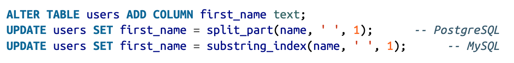

* The `schema-on-read` approach is advantageous if the items in the collection don’t all have the same structure for some reason (i.e., the data is heterogeneous)—for example, because:
    * There are many `different types of objects`, and it is `not practical to put each type of object in its own table`.
    * The `structure of the data is determined by external systems` over which you have no control and which may change at any time.

### Data locality for queries

* A document is usually stored as a `single continuous string`, encoded as `JSON, XML, or a binary variant thereof (such as MongoDB’s BSON)`. If your application often needs to access the entire document (for example, to render it on a web page), there is a `performance advantage to this storage locality`. If data is `split across multiple tables`, like in Figure 2-1, `multiple index lookups are required to retrieve it all`, which may require more disk seeks and take more time.
    * The locality advantage only applies if you need large parts of the document at the same time. The database typically needs to load the entire document, even if you access only a small portion of it, which can be wasteful on large documents. On updates to a document, the entire document usually needs to be rewritten—only modifications that don’t change the encoded size of a document can easily be performed in place [19]

* It’s worth pointing out that the idea of grouping related data together for locality is not limited to the document model. For example, `Google’s Spanner` database offers the same locality properties in a relational data model, by allowing the schema to declare that a table’s rows should be interleaved (nested) within a parent table [27]. Oracle allows the same, using a feature called multi-table index cluster tables [28]. The column-family concept in the Bigtable data model (used in Cassandra and HBase) has a similar purpose of managing locality [29].
    * Codd’s original description of the `relational model` [1] actually allowed something quite `similar to JSON documents` within a relational schema. He called it `nonsimple domains`. The idea was that a value in a row doesn’t have to just be a primitive datatype like a number or a string, but could also be a `nested relation (table)`—so you can have an arbitrarily nested tree structure as a value, much like the JSON or XML support that was `added to SQL over 30 years later`.

### Convergence of document and relational databases

* `Most relational database systems (other than MySQL) have supported XML since the mid-2000s`. This includes functions to make local modifications to XML documents and the ability to `index and query inside XML documents`, which allows applications to use data models very similar to what they would do when using a document database.
    * PostgreSQL since version 9.3 [8], MySQL since version 5.7, and IBM DB2 since ver‐ sion 10.5 [30] also have a similar level of support for `JSON documents`. Given the popularity of JSON for web APIs, it is likely that other relational databases will follow in their footsteps and add JSON support.
    * On the document database side, `RethinkDB` supports relational-like joins in its query language, and some `MongoDB` drivers automatically resolve database references (effectively performing a `client-side join`, although this is likely to be slower than a join performed in the database since it requires additional network round-trips and is less optimized).

### Query Languages for Data

* When the `relational model` was introduced, it included a new way of querying data: `SQL is a declarative query language`, whereas `IMS` and `CODASYL` queried the database using `imperative code`. What does that mean?

* Many commonly used programming languages are imperative. For example, if you have a list of animal species, you might write something like this to return only the sharks in the list:

* 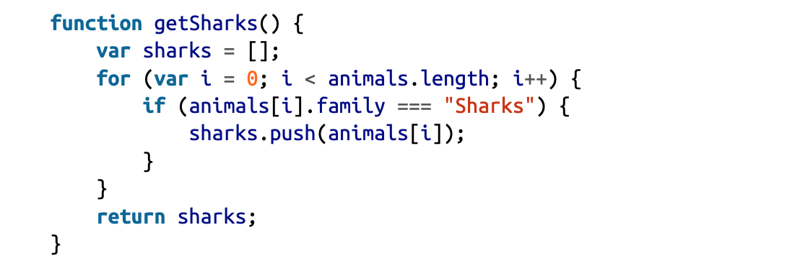 

* When SQL was defined, it followed the structure of the relational algebra fairly closely:

* 

* An `imperative language` tells the computer to perform certain operations in a certain order. You can imagine stepping through the code `line by line`, evaluating conditions, updating variables, and deciding whether to go around the loop one more time.

* In a `declarative query language`, like `SQL` or `relational algebra`, you just specify the `pattern of the data you want`—what conditions the results must meet, and how you want the data to be transformed (e.g., sorted, grouped, and aggregated)—**but not how to achieve that goal**. It is up to the database system’s query optimizer to decide which indexes and which join methods to use, and in which order to execute various parts of the query.
    * A declarative query language is attractive because it is typically more concise and easier to work with than an imperative API. But more importantly, it also hides imple‐ mentation details of the database engine, which makes it possible for the database system to introduce performance improvements without requiring any changes to queries.

* **For example, in the imperative code shown at the beginning of this section, the list of animals appears in a particular order. If the database wants to reclaim unused disk space behind the scenes, it might need to move records around, changing the order in which the animals appear. Can the database do that safely, without breaking queries?**

* **The SQL example doesn’t guarantee any particular ordering, and so it doesn’t mind if the order changes. But if the query is written as imperative code, the database can never be sure whether the code is relying on the ordering or not. The fact that SQL is more limited in functionality gives the database much more room for automatic optimizations.**

* Finally, `declarative languages` often lend themselves to `parallel execution`. Today, `CPUs are getting faster by adding **more cores**, not by running at significantly higher clock speeds than before` [31]. Imperative code is very hard to parallelize across multiple cores and multiple machines, because it specifies instructions that must be performed in a particular order. **Declarative languages have a better chance of getting faster in parallel execution because they specify only the pattern of the results, not the algorithm that is used to determine the results.** The database is free to use a parallel implementation of the query language, if appropriate [32].

### Declarative Queries on the Web

* The `advantages of declarative query languages` are not limited to just databases. To illustrate the point, let’s compare declarative and imperative approaches in a completely different environment: **a web browser.**

* 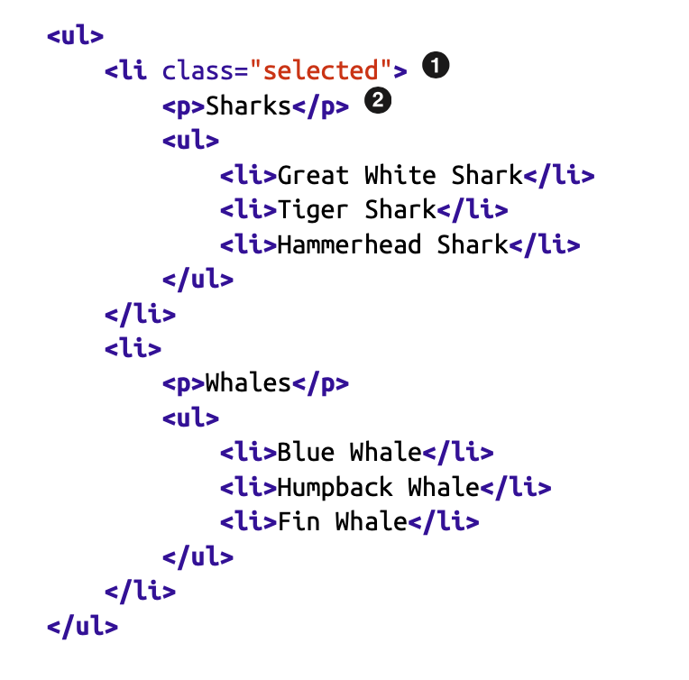

* Now say you want the title of the currently selected page to have a blue background, so that it is visually highlighted. `This is easy, using CSS`:

* 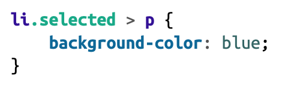 

* Here the CSS selector `li.selected > p` declares the pattern of elements to which we want to apply the blue style: namely, all `
` elements whose direct parent is an `<li>` element with a CSS class of `selected`. The element `
Sharks
` in the example matches this pattern, but `
Whales
` does not match because its `<li>` parent lacks `class="selected"`.

* Here, the `XPath` expression `li[@class='selected']/p` is equivalent to the CSS selector `li.selected > p` in the previous example. What `CSS and XSL` have in common is that they are both `declarative languages` for specifying the styling of a document.
Imagine what life would be like if you had to use an imperative approach. In JavaScript, using the core Document Object Model (DOM) API, the result might look something like this:

* 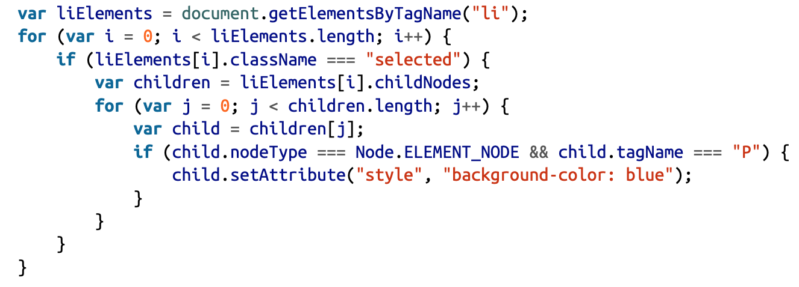

* This JavaScript imperatively sets the element `
Sharks
` to have a blue background, but the code is awful. Not only is it much longer and harder to understand than the CSS and XSL equivalents, but it also has some serious problems:

    * If the `selected` class is removed (e.g., because the user clicks a different page), the blue color won’t be removed, even if the code is rerun—and so the item will remain highlighted until the entire page is reloaded. With `CSS`, the browser `automatically` detects when the `li.selected > p` rule no longer applies and removes the blue background as soon as the selected class is removed.
    * If you want to take advantage of a new API, such as `document.getElementsBy ClassName("selected")` or `even document.evaluate()`—which may improve performance—you have to rewrite the code. On the other hand, browser vendors can improve the performance of `CSS and XPath without breaking compatibility`.

* **In a web browser, using declarative CSS styling is much better than manipulating styles imperatively in JavaScript. Similarly, in databases, declarative query languages like SQL turned out to be much better than imperative query APIs.vi**

### MapReduce Querying

* `MapReduce` is a programming model for processing `large amounts of data` in bulk across `many machines`, popularized by Google [33]. A limited form of `MapReduce` is supported by some `NoSQL` datastores, including `MongoDB and CouchDB`, as a mechanism for performing read-only queries across many documents.

* `MapReduce` is neither a `declarative query` language nor a fully `imperative query API`, but somewhere in between: the logic of the query is expressed with `snippets of code`, which are called repeatedly by the processing framework. It is based on the `map` (also known as `collect`) and `reduce` (also known as `fold` or `inject`) functions that exist in many functional programming languages.

* In PostgreSQL you might express that query like this:

* 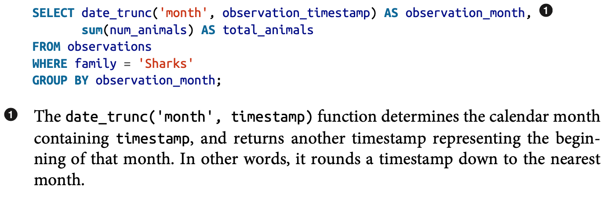

* The same can be expressed with `MongoDB’s MapReduce` feature as follows:

* 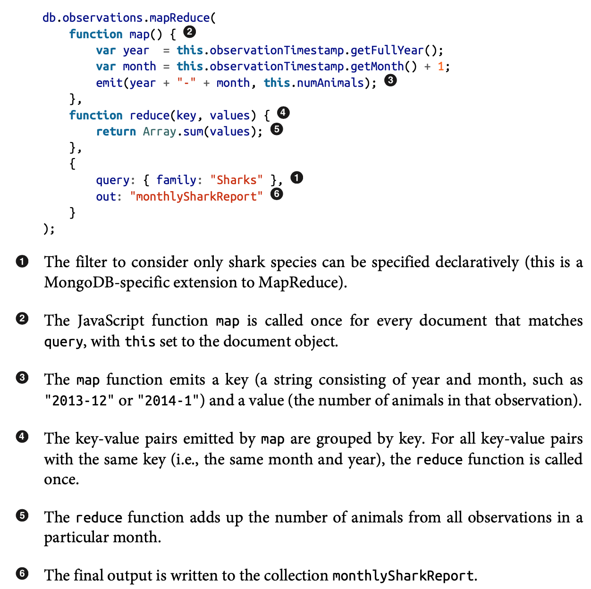

* 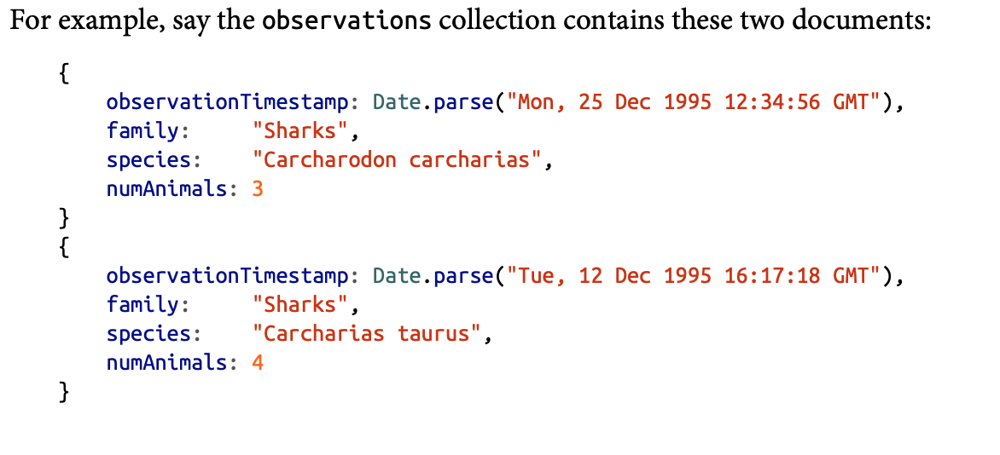

* The `map` function would be called once for each document, resulting in `emit("1995-12", 3) and emit("1995-12", 4)`. Subsequently, the `reduce function` would be called with `reduce("1995-12", [3, 4]), returning 7`.

* The `map` and `reduce` functions are somewhat restricted in what they are allowed to do. They must be `pure functions`, which means they `only use the data that is passed to them as input, they cannot perform additional database queries, and they must not have any side effects.` These restrictions allow the database to run the functions any where, in any order, and rerun them on failure. However, they are nevertheless powerful: they can parse strings, call library functions, perform calculations, and more.

* MapReduce is a fairly low-level programming model for distributed execution on a cluster of machines. Higher-level query languages like SQL can be implemented as a pipeline of MapReduce operations (see Chapter 10), but there are also many distributed implementations of SQL that don’t use MapReduce. **Note there is nothing in SQL that constrains it to running on a single machine, and MapReduce doesn’t have a monopoly on distributed query execution.**

* Moreover, a `declarative query language` offers more opportunities for a `query optimizer` to improve the performance of a query. For these reasons, MongoDB 2.2 added support for a `declarative query language called the aggregation pipeline` [9]. In this language, the same shark-counting query looks like this:

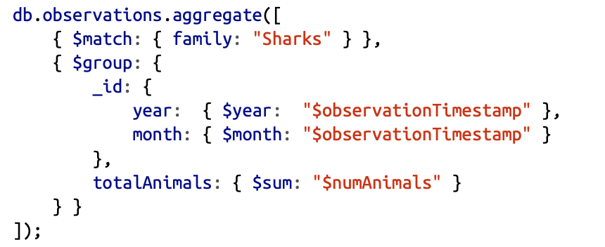

* The `aggregation pipeline` language is similar in expressiveness to a `subset of SQL`, but it uses a `JSON-based syntax` rather than SQL’s English-sentence-style syntax; the difference is perhaps a matter of taste. The moral of the story is that a NoSQL system may find itself accidentally reinventing SQL, albeit in disguise.

### Graph-Like Data Models

* We saw earlier that `many-to-many` relationships are an important distinguishing feature between different data models. If your application has mostly `one-to-many` relationships (`tree-structured data`) or `no relationships` between records, the `document model` is appropriate.

* But what if many-to-many relationships are very common in your data? The relational model can handle simple cases of many-to-many relationships, but as the connections within your data become more complex, **it becomes more natural to start modeling your data as a graph.**

* **A graph consists of two kinds of objects: vertices (also known as nodes or entities) and edges (also known as relationships or arcs).**

* Facebook maintains a `single graph` with many different types of `vertices` and `edges`: vertices represent people, locations, events, checkins, and comments made by users; edges indicate which people are friends with each other, which checkin happened in which location, who commented on which post, who attended which event, and so on [35].

* 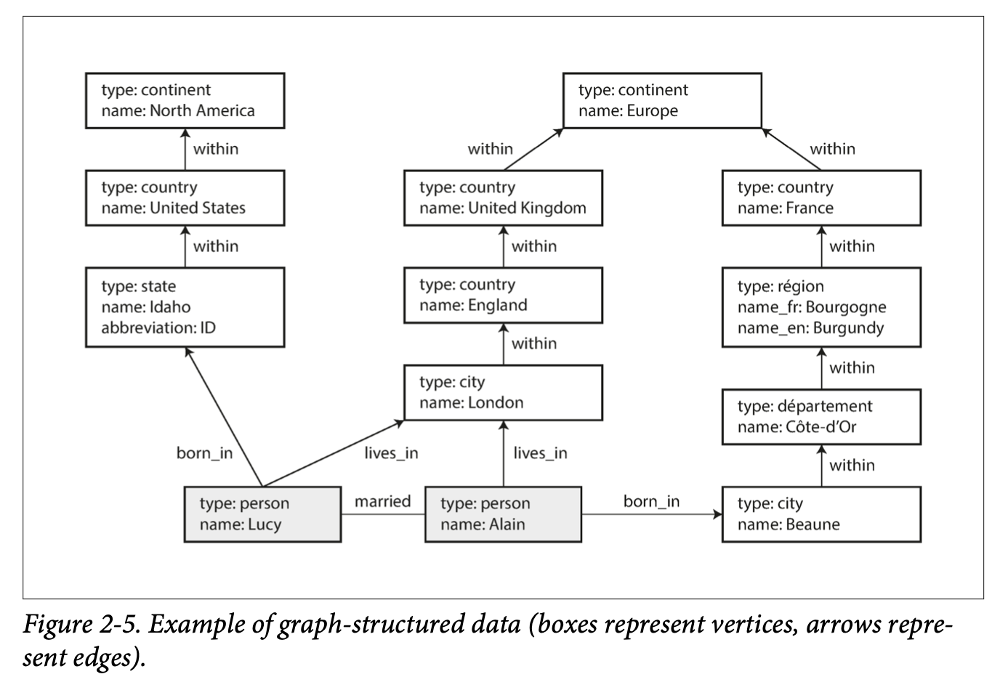

* There are several different, but related, ways of structuring and querying data in `graphs`. In this section we will discuss the `property graph model` (implemented by `Neo4j`, `Titan`, and `InfiniteGraph`) and the `triple-store model` (implemented by `Datomic`, `AllegroGraph`, and others). We will look at `three declarative query languages` for graphs: `Cypher`, `SPARQL`, and `Datalog`. Besides these, there are also `imperative graph query languages` such as `Gremlin` [36] and graph processing frame‐ works like Pregel (see Chapter 10).

### Property Graphs Model

* In the **`property graph`** model, each **`vertex`** consists of:
    * A `unique identifier`
    * A `set` of outgoing `edges`
    * A `set` of incoming `edges`
    * A collection of `properties` (`key-value pairs`)
  
* Each **`edge`** consists of:
    * A `unique identifier`
    * The `vertex` at which the `edge starts` (the `tail vertex`)
    * The `vertex` at which the `edge ends` (the `head vertex`)
    * A `label` to describe the kind of relationship between the `two vertices`
    * A collection of properties `(key-value pairs)`

* You can think of a `graph store` as consisting of `two relational tables`, one for `vertices` and one for `edges`, as shown in Example 2-2 (this schema uses the `PostgreSQL json datatype` to store the properties of each `vertex` or `edge`). The `head` and `tail` vertex are stored for each `edge`; **if you want the set of incoming or outgoing edges for a vertex, you can query the edges table by head_vertex or tail_vertex, respectively.**

* 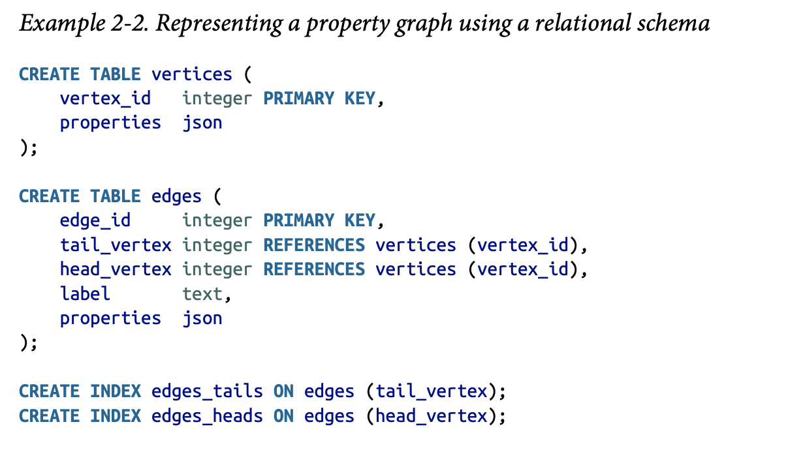

* Some important aspects of this model are:
    * **Any vertex can have an edge connecting it with any other vertex.** There is `no schema` that restricts which kinds of things can or cannot be associated.
    * Given any vertex, you can efficiently find both its incoming and its outgoing edges, and thus traverse the graph—i.e., follow a path through a chain of vertices —both forward and backward. (That’s why Example 2-2 has indexes on both the tail_vertex and head_vertex columns.)
    * **By using different labels for different kinds of relationships**, you can store several different kinds of information in a single graph, while still maintaining a clean data model.

### The Cypher Query Language

* **`Cypher is a declarative query language for property graphs`**, created for the `Neo4j graph database` [37]. (It is named after a character in the movie The Matrix and is not related to ciphers in cryptography [38].)

* 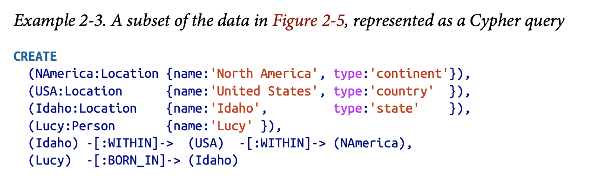

* `Example 2-3` shows the `Cypher query` to `insert` the lefthand portion of Figure 2-5 into a graph database. The rest of the graph can be added similarly and is omitted for readability. Each vertex is given a symbolic name like USA or Idaho, and other parts of the query can use those names to create edges between the vertices, using an arrow notation: `(Idaho) -[:WITHIN]-> (USA)` creates an `edge labeled WITHIN`, with `Idaho as the tail node` and `USA as the head node`.

* 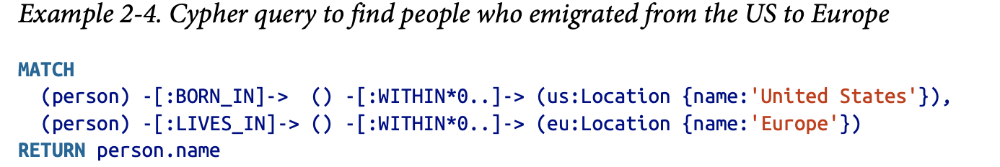

* `Example 2-4` shows how to express that query in `Cypher`. The same arrow notation is used in a `MATCH` clause to find patterns in the graph: `(person) -[:BORN_IN]-> ()` matches `any two vertices that are related by an edge labeled BORN_IN`. The `tail vertex` of that edge is bound to the variable person, and the head vertex is left unnamed.

* The query can be read as follows:
    * Find any `vertex` (call it person) that meets both of the following conditions:
        * `person` has an outgoing `BORN_IN` edge to some `vertex`. From that `vertex`, you can follow a `chain of outgoing WITHIN edges` until eventually you reach a `vertex of type Location`, whose name property is equal to `"United States"`.
        * That same person `vertex` also has an outgoing `LIVES_IN` edge. Following that edge, and then a chain of outgoing `WITHIN` edges, you eventually reach a vertex of type `Location`, whose name property is equal to `"Europe"`.

* But equivalently, you could start with the `two Location vertices` and `work backward`. If there is an index on the name property, you can probably efficiently find the two vertices representing the US and Europe. Then you can proceed to find all locations (states, regions, cities, etc.) in the US and Europe respectively by following all incoming `WITHIN edges`. Finally, you can look for people who can be found through an incoming `BORN_IN` or `LIVES_IN` edge at one of the location vertices.

* **As is typical for a declarative query language, you don’t need to specify such execution details when writing the query: the query optimizer automatically chooses the strategy that is predicted to be the most efficient, so you can get on with writing the rest of your application.**

### Graph Queries in SQL

* Example 2-2 suggested that graph data can be represented in a relational database. But if we put graph data in a relational structure, can we also query it using SQL?

* The `answer is yes`, but with `some difficulty`. In a `relational database`, you usually **know in advance which joins you need in your query**. In a graph query, you may need to traverse a variable number of edges before you find the vertex you’re looking for— that is, the number of joins is not fixed in advance.
    * In our example, that happens in the `() -[:WITHIN*0..]-> ()` rule in the `Cypher` query. A person’s `LIVES_IN` edge may point at `any kind of location`: a street, a city, a district, a region, a state, etc. A city may be `WITHIN` a region, a region `WITHIN` a state, a state `WITHIN` a country, etc. The `LIVES_IN` edge may point directly at the location vertex you’re looking for, or **it may be several levels removed in the location hierarchy.**
    * In Cypher, `:WITHIN*0..` expresses that fact very concisely: it means **“follow a `WITHIN` edge, `zero or more times.`”** It is like the `*` operator in a regular expression.

* Since `SQL:1999`, this idea of `variable-length traversal paths` in a query can be expressed using something called `recursive common table` expressions (the `WITH RECURSIVE` syntax). Example 2-5 shows the same query—finding the names of people who emigrated from the US to Europe—expressed in SQL using this technique (sup‐ ported in `PostgreSQL`, `IBM DB2`, `Oracle`, and `SQL Server`). However, the syntax is very clumsy in comparison to `Cypher`.

* 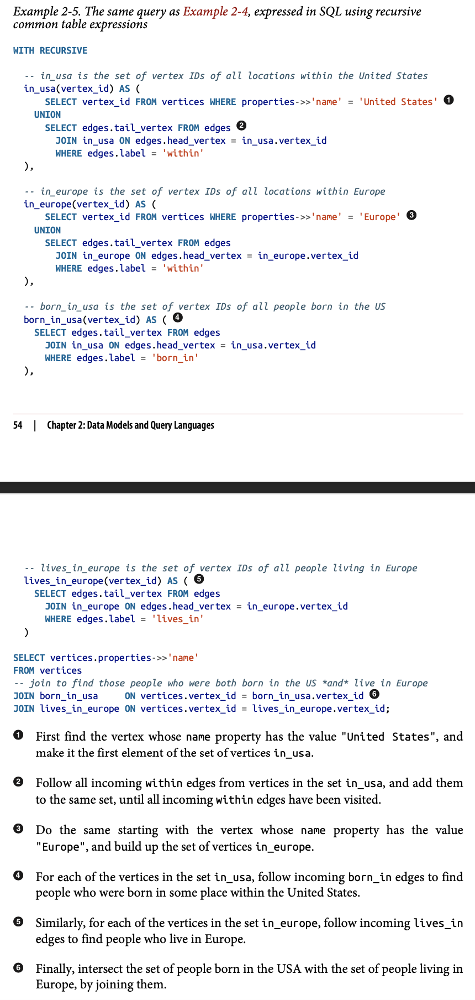

* **If the same query can be written in 4 lines in one query language but requires 29 lines in another, that just shows that different data models are designed to satisfy different use cases.** It’s important to pick a data model that is suitable for your application.

### Triple-Stores Model and SPARQL

* The `triple-store model` is mostly equivalent to the `property graph model`, **using different words to describe the same ideas.** It is nevertheless worth discussing, because there are various tools and languages for `triple-stores` that can be valuable additions to your toolbox for building applications.

* In a `triple-store`, all information is stored in the form of very simple `three-part statements`: (`subject`, `predicate`, `object`). For example, in the triple **(Jim, likes, bananas)**, Jim is the subject, likes is the predicate (verb), and bananas is the object.

* The `subject` of a `triple` is equivalent to a `vertex in a graph`. The object is one of two things:
    * A value in a `primitive datatype`, such as a `string or a number`. In that case, the `predicate and object` of the triple are equivalent to the **key and value of a property** on the subject vertex. For example, `(lucy, age, 33)` is like a `vertex lucy` with `properties {"age":33}`.
    * Another `vertex` in the `graph`. In that case, the predicate is an `edge` in the graph, the `subject is the tail vertex, and the object is the head vertex.` For example, in `(lucy, marriedTo, alain)` the subject and object lucy and alain are both vertices, and the predicate marriedTo is the label of the edge that connects them.

* 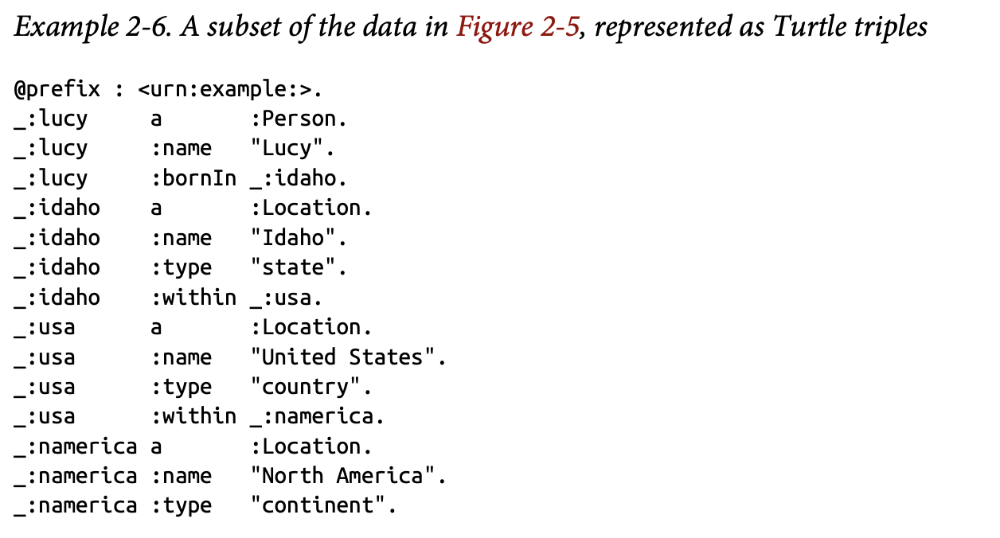

* It’s quite `repetitive` to repeat the same subject over and over again, but fortunately you can use semicolons to say multiple things about the same subject. **This makes the Turtle format quite nice and readable**: see Example 2-7.

* 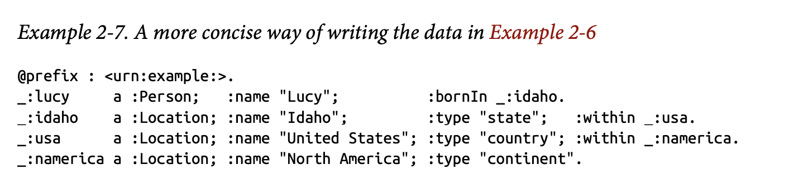

### The semantic web

* If you read more about `triple-stores`, you may get sucked into a maelstrom of articles written about the `semantic web`. The `triple-store data model` is completely **independent of the semantic web**—for example, `Datomic` [40] is a `triple-store` that does not claim to have anything to do with it.vii But since the two are so closely linked in many people’s minds, we should discuss them briefly.

* The `semantic web` is fundamentally a simple and reasonable idea: websites already publish information as text and pictures for humans to read, so why don’t they also publish information as machine-readable data for computers to read? The `Resource Description Framework (RDF`) [41] was intended as a mechanism for different web sites to publish data in a consistent format, allowing data from different websites to be automatically combined into a web of data—a kind of internet-wide “database of everything.”
    * Unfortunately, the semantic web was overhyped in the early 2000s but so far hasn’t shown any sign of being realized in practice, which has made many people cynical about it. It has also suffered from a dizzying plethora of acronyms, overly complex standards proposals, and hubris.
    * However, if you look past those failings, there is also a lot of `good work that has come out of the semantic web project`. `Triples` can be a good internal data model for applications, even if you have no interest in publishing `RDF` data on the semantic web.

### The RDF data model

* **The Turtle language we used in Example 2-7 is a human-readable format for RDF data.** Sometimes `RDF` is also written in an `XML` format, which does the same thing much more verbosely—see Example 2-8. `Turtle/N3` is preferable as it is much easier on the eyes, and tools like `Apache Jena` [42] can automatically convert between different `RDF formats` if necessary.

* 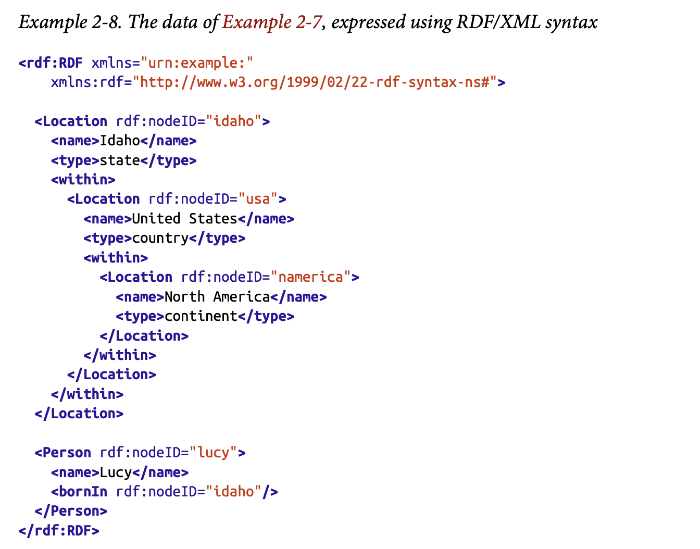

* `RDF` has a few quirks due to the fact that it is designed for internet-wide data exchange. The subject, predicate, and object of a triple are often URIs. For example, a predicate might be an URI such as <http://my-company.com/namespace#within> or <http://my-company.com/namespace#lives_in>, rather than just WITHIN or LIVES_IN. The reasoning behind this design is that you should be able to combine your data with someone else’s data, and if they attach a different meaning to the word within or lives_in, you won’t get a conflict because their predicates are actually <http://other.org/foo#within> and <http://other.org/foo#lives_in>.

### The SPARQL query language

* `SPARQL` is a query language for `triple-stores` using the `RDF` data model [43]. (It is an acronym for `SPARQL Protocol and RDF Query Language`, pronounced “sparkle.”) It predates `Cypher`, and since Cypher’s pattern matching is borrowed from `SPARQL`, they look quite similar [37].

* 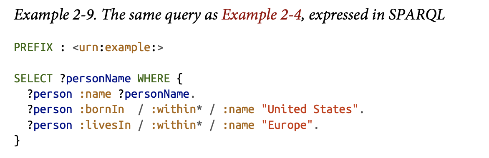

* The structure is very similar. The following two expressions are equivalent (variables start with a question mark in SPARQL):
      * 

* Because `RDF` **doesn’t distinguish between properties and edges but just uses predicates for both**, you can use the same syntax for matching properties. In the following expression, the variable usa is bound to any vertex that has a name property whose value is the string "United States":

* 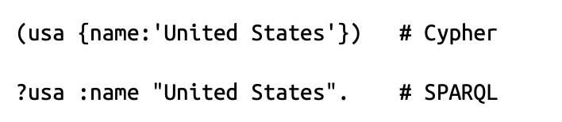 

* `SPARQL` is a nice query language—even if the semantic web never happens, it can be a powerful tool for applications to use internally.

### Graph Databases Compared to the Network Model

* In “Are Document Databases Repeating History?” on page 36 we discussed how CODASYL and the relational model competed to solve the problem of many-to- many relationships in IMS. At first glance, CODASYL’s network model looks similar to the graph model. Are graph databases the second coming of CODASYL in disguise?

* No. They differ in several important ways:
    * In CODASYL, a database had a schema that specified which record type could be nested within which other record type. **In a graph database, there is no such restriction: any vertex can have an edge to any other vertex. This gives much greater flexibility for applications to adapt to changing requirements.**
    * In CODASYL, the only way to reach a particular record was to traverse one of the access paths to it. **In a graph database, you can refer directly to any vertex by its unique ID, or you can use an index to find vertices with a particular value.**
    * In CODASYL, the children of a record were an ordered set, so the database had to maintain that ordering (which had consequences for the storage layout) and applications that inserted new records into the database had to worry about the positions of the new records in these sets. In a graph database, vertices and edges are not ordered (you can only sort the results when making a query).
    * **In CODASYL, all queries were imperative**, difficult to write and easily broken by changes in the schema. In a graph database, you can write your traversal in imperative code if you want to, **but most graph databases also support high-level, declarative query languages such as Cypher or SPARQL.**

### The Foundation: Datalog

* **`Datalog` is a much older language than `SPARQL` or `Cypher`**, having been studied extensively by academics in the **1980s** [44, 45, 46]. It is less well known among software engineers, but it is nevertheless important, because it provides the foundation that later query languages build upon.
    * In practice, Datalog is used in a few data systems: for example, it is the query language of `Datomic` [40], and `Cascalog` [47] is a `Datalog` implementation for querying large datasets in `Hadoop`.viii

* `Datalog’s data model` is similar to the `triple-store model`, generalized a bit. Instead of writing a triple as (subject, predicate, object), we write it as predicate(subject, object). Example 2-10 shows how to write the data from our example in Datalog.

* 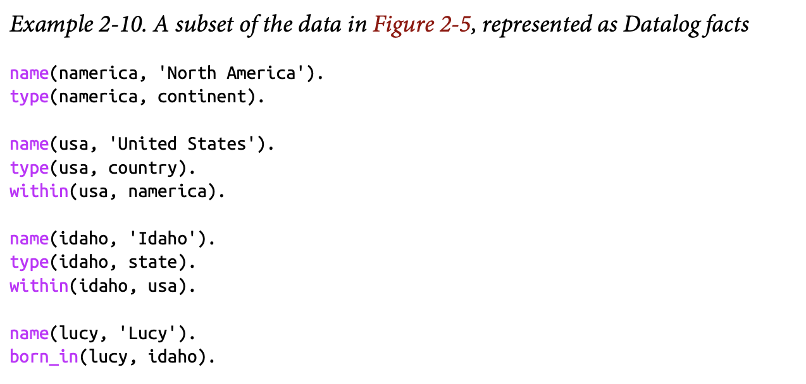

* Now that we have defined the data, we can write the same query as before, as shown in Example 2-11. It looks a bit different from the equivalent in `Cypher or SPARQL`, but don’t let that put you off. `Datalog` is a subset of `Prolog`, which you might have seen before if you’ve studied computer science.

* 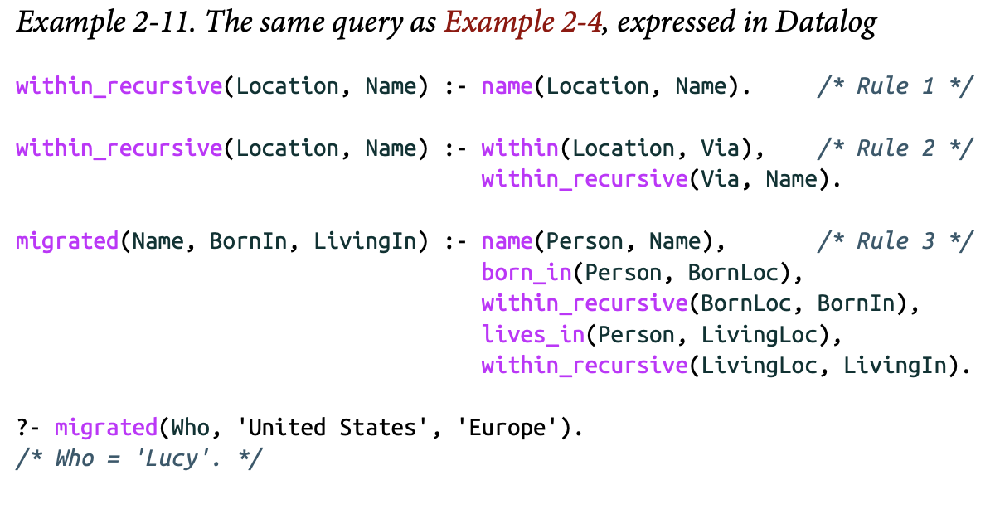

* `Cypher` and `SPARQL` jump in right away with SELECT, but **Datalog takes a small step at a time**. We define rules that tell the database about new predicates: here, we define two new predicates, `within_recursive` and `migrated`. These predicates aren’t triples stored in the database, but instead they are derived from data or from other `rules`. `Rules` can refer to other rules, just like functions can call other functions or recursively call themselves. Like this, complex queries can be built up a small piece at a time.
    * In rules, words that start with an uppercase letter are variables, and predicates are matched like in Cypher and SPARQL. **For example, name(Location, Name) matches the triple name(namerica, 'North America') with variable bindings Location = namerica and Name = 'North America'.**

* The `Datalog` approach requires a different kind of thinking to the other query lan‐ guages discussed in this chapter, but it’s a very powerful approach, because rules can be combined and reused in different queries. It’s less convenient for simple one-off queries, but it can cope better if your data is complex.

* 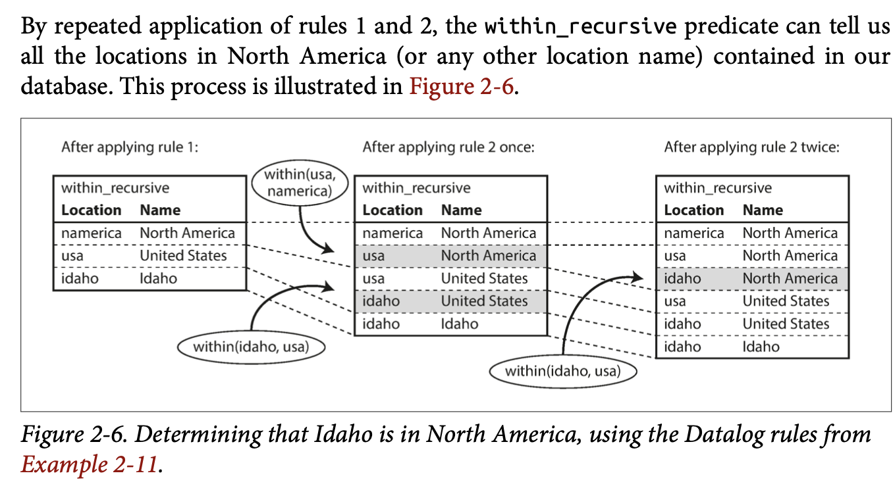

### Summary

* Historically, data started out being represented as one `big tree (the hierarchical model)`, but that wasn’t good for representing `many-to-many relationships`, so the relational model was invented to solve that problem. More recently, developers found that some applications don’t fit well in the `relational model` either. New nonrelational “NoSQL” datastores have diverged in two main directions:
    * Document databases target use cases where data comes in **self-contained documents and relationships between one document and another are rare.**
    * Graph databases go in the opposite direction, targeting use cases **where anything is potentially related to everything.**

* All three models `(document, relational, and graph)` are widely used today, and each is good in its respective domain. One model can be emulated in terms of another model —for example, graph data can be represented in a relational database—but the result is often awkward. That’s why we have different systems for different purposes, not a single one-size-fits-all solution.  

* **One thing that document and graph databases have in common is that they typically `don’t enforce a schema for the data they store`, which can make it easier to adapt applications to changing requirements.** However, your application most likely still assumes that data has a certain structure; it’s just a question of whether the schema is explicit (enforced on write) or implicit (handled on read).

* Each data model comes with its own query language or framework, and we discussed several examples: SQL, MapReduce, MongoDB’s aggregation pipeline, Cypher, SPARQL, and Datalog. We also touched on CSS and XSL/XPath, which aren’t data‐ base query languages but have interesting parallels.

* Although we have covered a lot of ground, there are **still many data models left unmentioned**. To give just a few brief examples:
    * Researchers working with genome data often need to perform sequence- similarity searches, which means **taking one very long string (representing a DNA molecule) and matching it against a large database of strings that are similar, but not identical**. None of the databases described here can handle this kind of usage, which is why researchers have written specialized `genome database` software like `GenBank` [48].
    * `Particle physicists` have been doing Big Data–style large-scale data analysis for decades, and projects like the Large Hadron Collider (LHC) now work with hundreds of petabytes! At such a scale custom solutions are required to stop the hardware cost from spiraling out of control [49].
    * `Full-text search` is arguably a kind of data model that is frequently used alongside databases. `Information retrieval` is a large specialist subject that we won’t cover in great detail in this book, but we’ll touch on `search indexes` in Chapter 3 and Part III.

## Chapter 3 - Storage and Retrieval

* On the most fundamental level, a database needs to do two things: when you give it some data, it should store the data, and when you ask it again later, it should give the data back to you.

* **In particular, there is a big difference between storage engines that are optimized for `transactional  workloads`  and  those  that  are  optimized  for  `analytics`.**  We  will  explore that  distinction  later  in  “Transaction  Processing  or  Analytics?”  on  page  90,  and  in “Column-Oriented Storage” on page 95 we’ll discuss a family of storage engines that is optimized for analytics.

* We  will  examine  `two  families  of storage  engines`:  `log-structured`  storage  engines,  and  `page-oriented  storage  engines`
such as `B-trees`.

### Data Structures That Power Your Database

* Consider the world’s simplest database, implemented as two Bash functions:

* 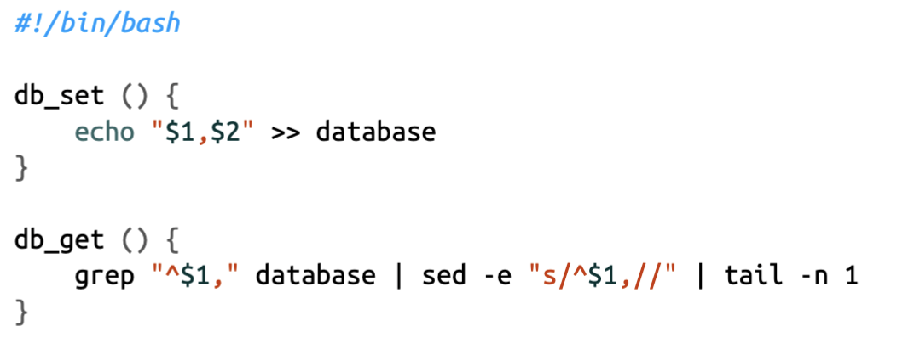

* These  two  functions  implement  a  `key-value`  store. You  can  call  `db_set` key value, which  will  store  `key`  and  `value`  in  the  database.  The  `key`  and  `value`  can  be  (almost) anything you like—for example, the value could be a `JSON document`. You can then call `db_get` key, which looks up the most recent value associated with that particular `key` and returns it.

* 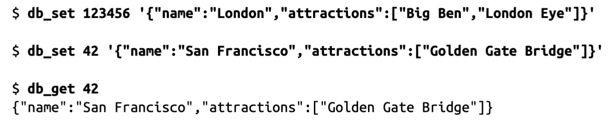

* The  underlying  storage  format  is  very  simple:  a  text  file  where  each  line  contains  a `key-value`  pair,  separated  by  a  comma  (roughly  like  a  `CSV`  file,  ignoring  escaping issues). Every call to `db_set` appends to the end of the file, so if you update a key several times, the old versions of the value are **not overwritten**—you need to look at the last  occurrence  of  a  `key`  in  a  `file`  to  find  the  `latest  value`  (hence  the  `tail  -n  1`  in
`db_get`):

* 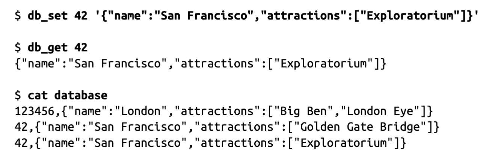

* Our  `db_set`  function  actually  has  pretty  good  performance  for  something  that  is  so simple,  because  `appending  to  a  file  is  generally  very  efficient`.  Similarly  to  what `db_set`  does,  many  databases  internally  use  a  **`log`,  which  is  an  `append-only  data  file`.**

* Real  databases  have  more  issues  to  deal  with  (such  as  **concurrency  control, reclaiming disk space so that the log doesn’t grow forever, and handling errors and partially written  records**),  but  the  basic principle  is  the  same.  Logs  are  incredibly  useful, and we will encounter them several times in the rest of this book.

* On the other hand, our `db_get` function has **terrible performance** if you have a large number  of  records  in  your  database.  Every  time  you  want  to  look  up  a  key,  `db_get` has to scan the entire database file from beginning to end, looking for occurrences of the key. In algorithmic terms, the cost of a lookup is `O(n)`: if you double the number of records n in your database, a lookup takes twice as long. That’s not good.

* **In  order  to  efficiently  find  the  value  for  a  particular  key  in  the  database,  we  need  a different data structure: an `index`.**
    * the  general  idea  behind  them  is  to  keep  some `additional metadata on the side`, which acts as a `signpost` and helps you to locate the data you want. If you want to `search the same data in several different ways`, you may need `several different indexes` on `different parts of the data`.

* An `index` is an **additional structure** that is derived from the **primary data**. Many databases allow you to `add and remove indexes`, and this doesn’t affect the contents of the database; it **only affects the performance of queries**.

* **Maintaining additional structures incurs overhead**, especially **on writes**. For writes, it’s hard to beat the performance of simply **appending  to  a  file**,  because  that’s  the  simplest  possible  `write  operation`.  Any kind of `index usually slows down writes`, because the **index also needs to be updated every time data is written**.

* **This is an important trade-off in storage systems: well-chosen indexes speed up read queries,  but  every  index  slows  down  writes.**

### Hash Indexes

* **Let’s  start  with  indexes  for  key-value  data.**
    * Useful  building  block  for  more  complex indexes.
    * Since  we  already  have  `hash  maps`  for  our  `in-memory data structures`, why not use them to index our data on disk?

* Let’s  say  our  `data  storage`  consists  only  of  **appending  to  a  file**,  as  in  the  preceding example.  Then  the  simplest  possible  indexing  strategy  is  this:  keep  an  `in-memory hash map where every key is mapped to a byte offset` in the `data file`—the location at which  the  value  can  be  found,  as  illustrated  in  Figure  3-1. 

* 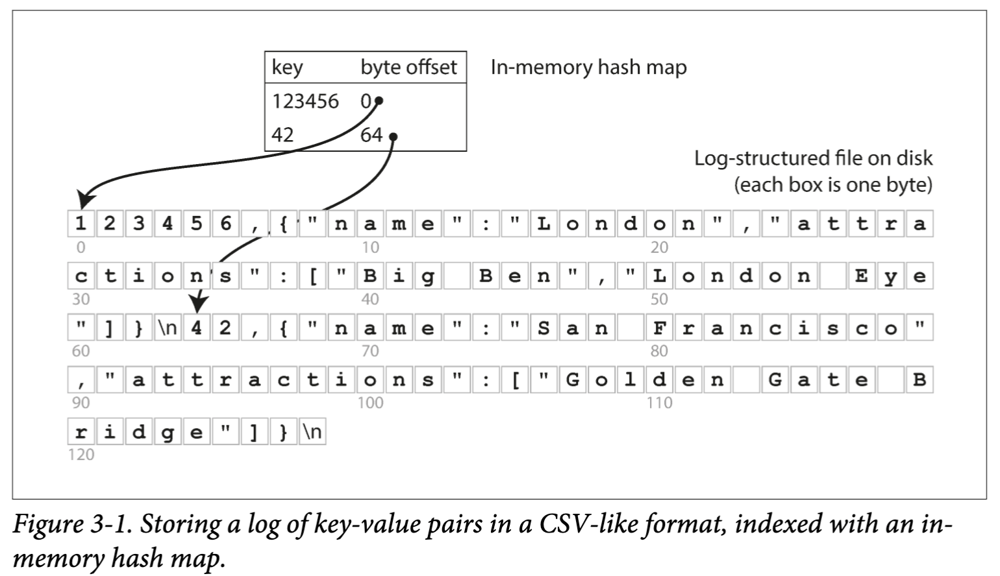
    * this works both for inserting new keys and for updating existing keys)
  
* This may sound simplistic, but it is a viable approach. In fact, this is essentially what `Bitcask` (the default `storage engine in Riak`) does [3]. `Bitcask` offers `high-performance reads and writes`, subject to the **requirement that all the keys fit in the available RAM, since  the  hash  map  is  kept  completely  in  memory.  The  values  can  use  more  space than there is available memory, since they can be loaded from disk with just one disk seek.  If that  part  of  the  data  file  is  already  in the  filesystem  cache,  a  read  doesn’t require any disk I/O at all.**

* A storage engine like `Bitcask` is well suited to situations where the value for each key is **updated frequently**. For example, the key might be the URL of a cat video, and the value  might  be  the ` number  of  times  it  has  been  played` (incremented  every  time someone hits the play button). In this kind of workload, there are a `lot of writes`, but there are `not too many distinct keys`—you have a `large number of writes per key`, but `it’s feasible to keep all keys in memory.`

* **As described so far, we only ever append to a file—so how do we avoid eventually running out of disk space?**
    * A good solution is to break the `log` into `segments` of a certain size by **closing a segment file when it reaches a certain size**, and making **subsequent writes to a new segment file.**
    * We can then perform `compaction on these segments`, as illustrated in Figure 3-2. `Compaction means throwing away duplicate keys` in the `log`, and keeping only the **most recent update for each key**.

* 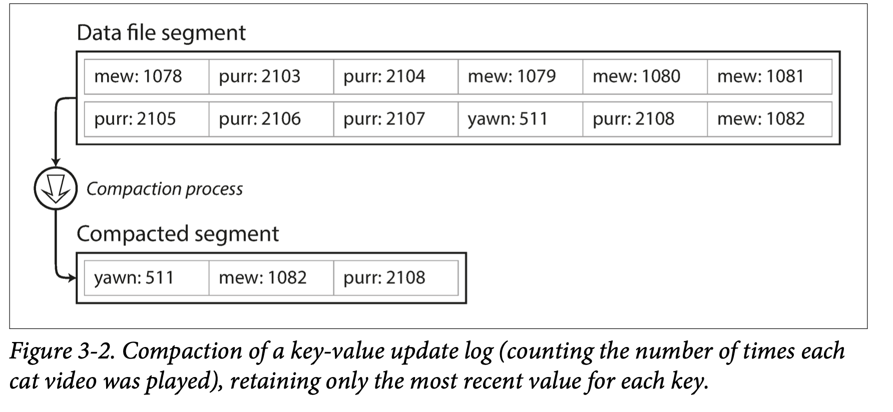

* Moreover, since **compaction often makes segments much smaller** (assuming that a key is overwritten several times on average within one segment), we can also **merge several segments together at the same time as performing the compaction**, as shown in Figure 3-3. 

* 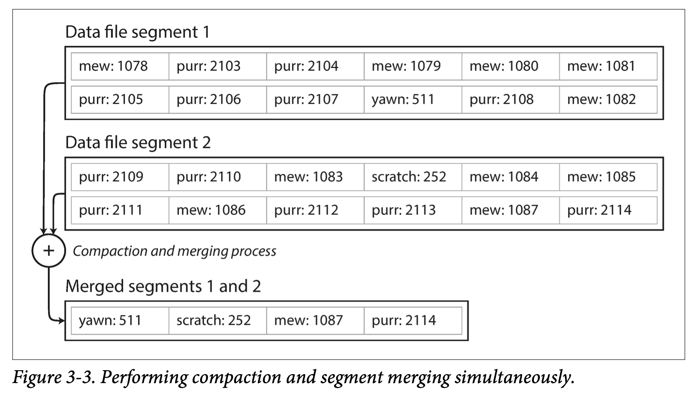
    * Segments are **never modified after they have been written**, so the `merged segment is written to a new file`. The merging and compaction of frozen segments can be done in a **background thread**, and while it is going on, we can still **continue to serve read and write requests as normal**, using the `old segment files`.
        * After the merging process is complete, we `switch read requests to using the new merged segment instead` of the old segments—and then the **old segment** files can `simply be deleted`.

* Each `segment` now has **its own in-memory hash table**, mapping keys to `file offsets`. In order to find the value for a key, we first **check the most recent segment’s hash map**; if the key is not present we check the **second-most-recent segment, and so on**. The `merging process` keeps the number of `segments small`, so lookups **don’t need to check many hash maps**.

* Lots of detail goes into making this simple idea work in practice. Briefly, some of the issues that are important in a real implementation are:
    * File format
        * CSV is not the best format for a log. It’s faster and simpler to use a **binary format that first encodes the length of a string in bytes**, `followed by the raw string (without need for escaping)`.
    * Deleting records
        * If you want to delete a key and its associated value, you have to **append a special deletion record to the data file (sometimes called a tombstone)**. `When log segments are merged, the tombstone tells the merging process to discard any previous values for the deleted key.`
    * Crash recovery
        * If the **database is restarted**, the `in-memory` **hash maps are lost**. In principle, you can restore each segment’s hash map by reading the entire segment file from beginning to end and noting the offset of the most recent value for every key as you go along. However, that might take a long time if the segment files are large, which would make server restarts painful. **Bitcask speeds up recovery by storing a snapshot of each segment’s hash map on disk, which can be loaded into memory more quickly.**
    * Partially written records
        * The database may crash at any time, including **halfway through appending a record to the log**. `Bitcask` files include `checksums`, allowing such corrupted parts of the log to be detected and ignored.
    * Concurrency control
        * As writes are appended to the `log` in a `strictly sequential order`, a common implementation choice is to have only **one writer thread**. Data file segments are `append-only and otherwise immutable`, so they can be **read concurrently by multiple threads.**

* An `append-only` log seems wasteful at first glance: **why don’t you update the file in place**, overwriting the old value with the new value? But an **append-only design turns out to be good for several reasons**:
    * **Appending and segment merging are sequential write operations**, which are generally **much faster than random writes**, especially on magnetic spinning-disk hard drives. To some extent **sequential writes are also preferable on flash-based solid state drives (SSDs)** [4]. We will discuss this issue further in “Comparing B-Trees and LSM-Trees” on page 83.
    * **Concurrency and crash recovery are much simpler if segment files are append only or immutable**. For example, you **don’t have to worry** about the case where a `crash happened while a value was being overwritten`, leaving you with a file containing part of the old and part of the new value spliced together.
    * Merging old segments avoids the problem of data files getting fragmented over time.

* However, the hash table index also **has limitations**:
    * The **hash table must fit in memory**, so if you have a very large number of keys, you’re out of luck. In principle, you could maintain a hash map on disk, but unfortunately it is **difficult to make an on-disk hash map perform well**. It requires a `lot of random access I/O, it is expensive to grow when it becomes full`, and hash collisions require fiddly logic [5].
    * **Range queries are not efficient**. For example, you cannot easily scan over all keys between `kitty00000` and `kitty99999` you’d have to look up each key individu‐ ally in the hash maps.

### SSTables and LSM-Trees

* In Figure 3-3, each `log-structured storage segment` is a sequence of `key-value` pairs. **These pairs appear in the order that they were written**, and values later in the log take precedence over values for the same key earlier in the log. Apart from that, the order of key-value pairs in the file does not matter.
    * Now we can make a simple change to the format of our segment files: we require that the sequence of `key-value` pairs is `sorted by key`. At first glance, that requirement seems to break our ability to use `sequential writes`, but we’ll get to that in a moment.

* We call this format **Sorted String Table, or SSTable for short.** We also require that `each key only appears once within each merged segment file` **(the compaction process already ensures that)**. `SSTables` have several big advantages over `log segments with hash indexes`:
    * `Merging segments is simple and efficient`, even if the files are bigger than the available memory. The approach is like the one used in the **mergesort algorithm** and is illustrated in Figure 3-4: you start reading the input files side by side, look at the **first key in each file**, copy the lowest key **(according to the sort order)** to the output file, and repeat. This produces a new merged segment file, also **sorted by key**.

* 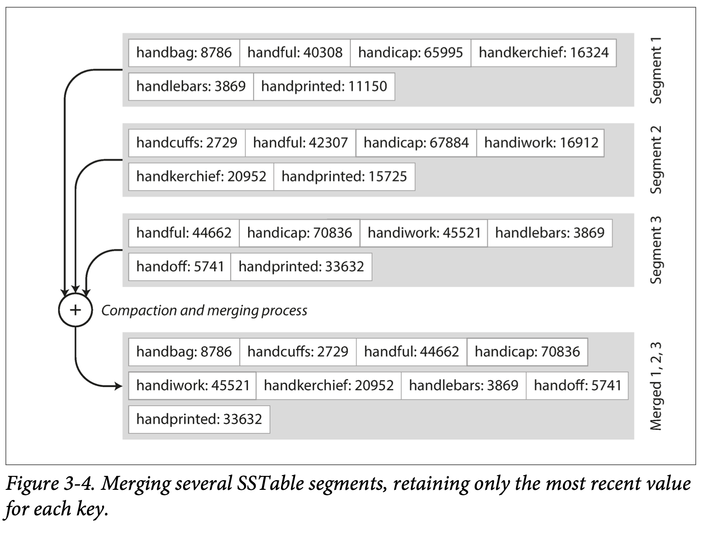
    * What if the `same key appears in several input segments?` Remember that each segment contains all the values written to the database during some period of time. **This means that all the values in one input segment must be more recent than all the values in the other segment (assuming that we always merge adjacent segments)**. When multiple segments contain the same key, we can `keep the value from the most recent segment and discard the values in older segments.`
    * **In order to find a particular key in the file, you no longer need to keep an index of all the keys in memory**. See Figure 3-5 for an example: say you’re looking for the key handiwork, but you don’t know the exact offset of that key in the segment file. However, you do know the offsets for the keys handbag and handsome, and because of the sorting you know that handiwork must appear between those two. This means you can jump to the offset for handbag and scan from there until you find handiwork (or not, if the key is not present in the file).

* 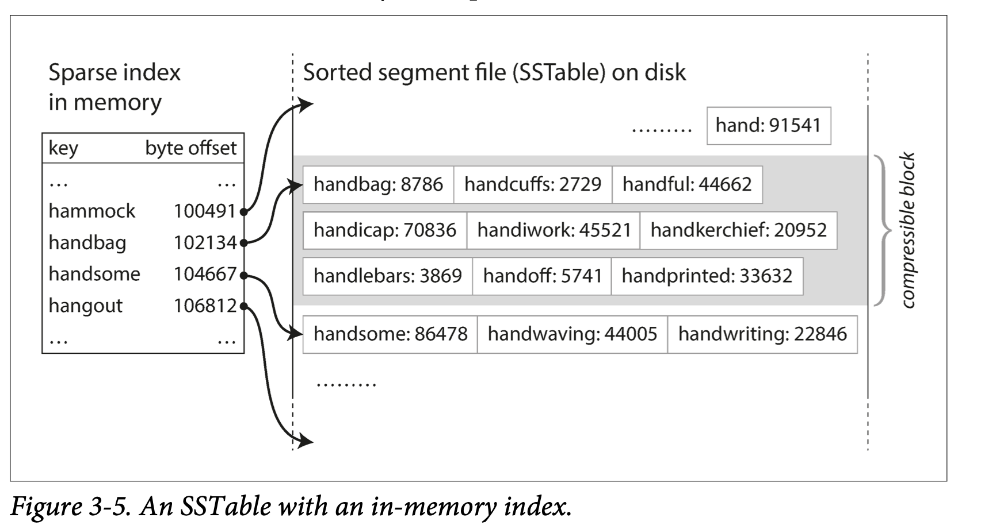 
    * **You still need an in-memory index to tell you the offsets for some of the keys, but it can be sparse: `one key for every few kilobytes of segment file is sufficient`, because a `few kilobytes can be scanned very quickly`.i**
        * If all keys and values had a fixed size, you could use `binary search` on a `segment file` and avoid the in-memory index entirely. However, they are usually `variable-length` in practice, which makes it difficult to tell where one record ends and the next one starts if you don’t have an index.
    * Since read requests need to scan over several `key-value` pairs in the requested range anyway, it is possible to **group those records into a block and compress it before writing it to disk** (indicated by the shaded area in Figure 3-5). Each entry of the sparse in-memory index then points at the start of a compressed block. **Besides saving disk space, compression also reduces the I/O bandwidth use.**

* Constructing and maintaining `SSTables`

    * **Fine so far—but how do you get your data to be sorted by key in the first place? Our incoming writes can occur in any order.**

    * Maintaining a sorted structure **on disk** is possible (see `B-Trees` on page 79), but maintaining it **in memory** is much easier. There are plenty of well-known tree data structures that you can use, such as `red-black trees` or `AVL trees` [2]. With these data structures, you can insert keys in any order and read them back in `sorted order`.

    * We can now make our storage engine work as follows:

        * When a write comes in, add it to an `in-memory balanced tree data structure` (for example, a `red-black tree`). This in-memory tree is sometimes called a `memtable`.
        * When the `memtable` gets bigger than some threshold—typically a `few megabytes-write` it out to disk as an `SSTable` file. This can be done efficiently because the tree already maintains the `key-value pairs sorted by key`. The new `SSTable` file becomes the most recent `segment` of the database. While the `SSTable` is being written out to disk, writes can continue to a new `memtable` instance.
        * In order to serve a read request, first try to find the key in the `memtable`, then in the most recent `on-disk segment`, then in the `next-older segment`, etc.
        * From time to time, run a `merging and compaction process in the background` to combine `segment files` and to `discard overwritten or deleted values`.
    
    * This scheme works very well. It only suffers from one problem: if the database crashes, the most recent writes (which are in the `memtable` but not yet written out to `disk`) are lost. In order to avoid that problem, we can keep a `separate log on disk` to which every write is **immediately appended**, just like in the previous section. That log is **not in sorted order**, but that doesn’t matter, because its only purpose is to `restore the memtable` **after a crash**. Every time the `memtable` is written out to an `SSTable`, the corresponding **log can be discarded**.

* Making an LSM-tree out of SSTables

    * The algorithm described here is essentially what is used in `LevelDB` [6] and `RocksDB` [7], `key-value storage engine libraries` that are designed to be embedded into other applications. Among other things, `LevelDB` can be used in `Riak` as an alternative to `Bitcask` (the hashtable with simple log files / no SSTables). Similar storage engines are used in `Cassandra` and `HBase` [8], both of which were inspired by `Google’s Bigtable` paper [9] (which introduced the terms `SSTable` and `memtable`).

    * Originally this `indexing structure` was described by Patrick O’Neil et al. under the name `Log-Structured Merge-Tree (or LSM-Tree)` [10], building on earlier work on `log-structured filesystems` [11]. Storage engines that are based on this principle of `merging and compacting sorted files` are often called `LSM storage engines`.

    * **Lucene**, an indexing engine for full-text search **used by Elasticsearch and Solr**, uses a similar method for storing its term dictionary [12, 13]. A full-text index is much more complex than a key-value index but is based on a similar idea: given a word in a search query, find all the documents (web pages, product descriptions, etc.) that mention the word. This is implemented with a `key-value structure` where the `key is a word (a term) and the value is the list of IDs of all the documents that contain the word` (the postings list). In Lucene, this mapping from term to postings list is kept in `SSTable-like sorted files`, which are `merged in the background as needed` [14].

* Performance optimizations

    * As always, a lot of detail goes into making a storage engine perform well in practice. For example, the `LSM-tree algorithm` **can be slow when looking up keys that do not exist in the database**: `you have to check the memtable, then the segments all the way back to the oldest (possibly having to read from disk for each one) before you can be sure that the key does not exist.` In order to optimize this kind of access, storage engines often use additional `Bloom filters` [15]. (**A Bloom filter is a memory-efficient data structure for approximating the contents of a set. It can tell you if a key does not appear in the database, and thus saves many unnecessary disk reads for nonexistent keys.**)

    * There are also different strategies to determine the order and timing of how `SSTables` are `compacted and merged`. The most common options are `size-tiered` and `leveled compaction`. `LevelDB` and `RocksDB` use `leveled compaction` (hence the name of `LevelDB`), `HBase` uses `size-tiered`, and `Cassandra supports both` [16]. In `size-tiered` compaction, **newer and smaller SSTables are successively merged into older and larger SSTables**. In `leveled compaction`, the key range is **split up into smaller SSTables and older data is moved into separate “levels,”** which allows the compaction to proceed more incrementally and use less disk space.

    * Even though there are many subtleties, the basic idea of `LSM-trees—keeping a cascade of SSTables` that are `merged in the background` is simple and effective. Even when the dataset is much bigger than the available memory it continues to work well. Since data is stored in `sorted order`, you can efficiently perform `range queries` (scanning all keys above some minimum and up to some maximum), and because the disk writes are sequential the LSM-tree can support remarkably high write throughput.

* B-Trees

    * The `log-structured indexes` we have discussed so far are gaining acceptance, but they are `not the most common type of index`. The most widely used indexing structure is quite different: the `B-tree`.
    
    * Introduced in 1970 [17] and called “ubiquitous” less than 10 years later [18], `B-trees` have **stood the test of time very well**. They remain the standard index implementation in almost `all relational databases, and many nonrelational databases use them too`.
    
    * Like `SSTables`, `B-trees` keep `key-value pairs sorted by key`, which allows **efficient key value lookups and range queries**. But that’s where the similarity ends: `B-trees` have a very different design philosophy.

    * The `log-structured indexes` we saw earlier break the database down into `variable-size segments`, typically `several megabytes or more in size`, and always write a segment sequentially. By contrast, `B-trees` **break the database down into fixed-size blocks or pages**, traditionally `4 KB in size (sometimes bigger)`, and read or write one page at a time. This design corresponds more closely to the underlying hardware, as disks are also arranged in fixed-size blocks.
        * The size of a page is corelated to the "Allocation unit size" / "Sector size" of your hard drive file system type.
    
    * Each page can be identified using an `address or location`, which allows one page to refer to another—similar to a pointer, but on disk instead of in memory. We can use these page references to construct a tree of pages, as illustrated in Figure 3-6.

    * 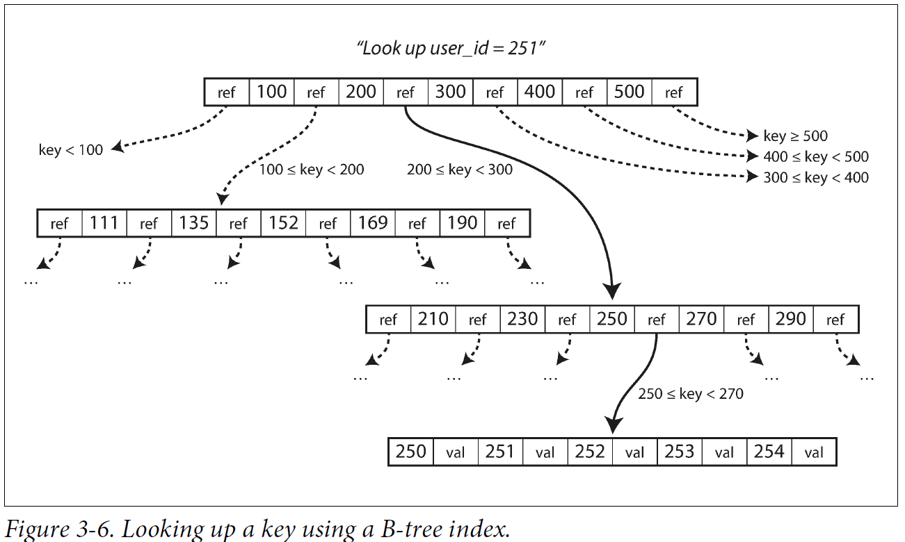 

    * One page is designated as the `root` of the `B-tree`; whenever you want to look up a key in the index, you start here. The page contains several keys and references to `child pages`. Each child is responsible for a `continuous range of keys`, and the keys between the references indicate where the boundaries between those ranges lie.

    * The `number of references to child pages` in `one page` of the `B-tree` is called the `branching factor`. For example, in Figure 3-6 the branching factor is six. In practice, the branching factor depends on the amount of space required to store the page references and the range boundaries, but typically it is **several hundred**.

    * If you want to `update` the value for an `existing key in a B-tree`, you `search for the leaf page containing that key` (O log(n)), change the value in that page, and `write the page back to disk (any references to that page remain valid)`. If you want to `add a new key`, you need to `find the page whose range encompasses the new key and add it to that page`. If there **isn’t enough free space in the page to accommodate the new key, it is split into two half-full pages, and the parent page is updated to account for the new subdivision of key ranges—see Figure 3-7.ii**

    * 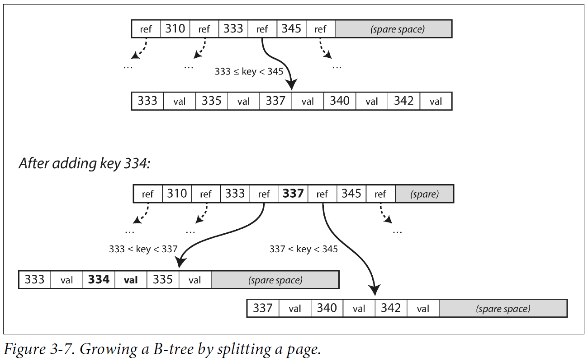 

    * This `algorithm` ensures that the **tree remains balanced**: a `B-tree` with `n keys` always has a depth of `O(log n)`. Most databases can fit into a `B-tree` that is **three or four levels deep**, so you don’t need to follow many page references to find the page you are looking for. (**A four-level tree of 4 KB pages with a branching factor of 500 can store up to 256 TB.**)
        * 4KB + 4KB * 500 = 2000KB (20MB)
        * 500 * 500 = 250000 * 4KB = 1000000KB = 1000MB = 1GB
        * etc..

* Making B-trees reliable

    * The basic underlying write operation of a `B-tree` is to overwrite a page **on disk with new data**. It is assumed that the **overwrite does not change the location of the page**; i.e., all references to that page remain intact when the page is overwritten. This is in stark contrast to **log-structured indexes such as LSM-trees, which only append to files** (and eventually delete obsolete files) but **never modify files in place**.

        * You can think of overwriting a page on disk as an actual hardware operation. On a magnetic hard drive, this means moving the disk head to the right place, waiting for the right position on the spinning platter to come around, and then overwriting the appropriate sector with new data. On SSDs, what happens is somewhat more complicated, due to the fact that an SSD must erase and rewrite fairly large blocks of a storage chip at a time [19].
    
    * Moreover, some operations require `several different pages to be overwritten`. For example, **if you split a page because an insertion caused it to be overfull, you need to write the two pages that were split, and also overwrite their parent page to update the references to the two child pages. This is a dangerous operation, because if the database crashes after only some of the pages have been written, you end up with a corrupted index** (e.g., there may be an orphan page that is not a child of any parent).

    * In order to make the database resilient to crashes, it is common for `B-tree` implementations to include an additional data structure on disk: `a write-ahead log (WAL, also known as a redo log)`. This is an `append-only` file to which every `B-tree` modification **must be written before it can be applied to the pages of the tree itself**. When the database comes back up after a crash, **this log is used to restore the B-tree back to a consistent state** [5, 20].

    * An additional complication of updating pages in place is that `careful concurrency control is required if multiple threads are going to access the B-tree at the same time` —otherwise a thread may see the tree in an inconsistent state. **This is typically done by protecting the tree’s data structures with latches (lightweight locks)**. `Logstructured approaches are simpler in this regard, because they do all the merging in the background without interfering with incoming queries and atomically swap old segments for new segments from time to time`.

* B-tree optimizations
    * Instead of overwriting pages and maintaining a `WAL for crash recovery`, some databases `(like LMDB) use a copy-on-write scheme` [21]. A modified page is written to a `different location`, and a `new version of the parent pages in the tree is created, pointing at the new location`. This approach is also useful for concurrency control, as we shall see in “Snapshot Isolation and Repeatable Read” on page 237.
    * We can save space in pages by not storing the `entire key`, but `abbreviating it`. Especially in pages on the `interior of the tree`, keys only need to provide enough information to act as boundaries between `key ranges`. **Packing more keys into a page allows the tree to have a higher branching factor, and thus fewer levels.**iii
        * This variant is sometimes known as a `B+ tree`, although the optimization is so common that it often isn’t distinguished from other `B-tree` variants.

    * In general, **pages can be positioned anywhere on disk**; there is nothing requiring pages with nearby key ranges to be **nearby on disk**. If a query needs to scan over a large part of the key range in sorted order, that page-by-page layout can be **inefficient**, because a **disk seek may be required for every page that is read**. Many `Btree` implementations therefore try to **lay out the tree so that leaf pages appear in sequential order on disk**. However, it’s difficult to maintain that order as the tree grows. **By contrast, since `LSM-trees` rewrite large segments of the storage in one go during merging, it’s easier for them to keep sequential keys close to each other on disk.**

    * **Additional pointers have been added to the tree. For example, each leaf page may have references to its sibling pages to the left and right, which allows scanning keys in order without jumping back to parent pages.**

    * `B-tree variants such as fractal trees` [22] borrow some `log-structured` ideas to reduce disk seeks (and they have nothing to do with fractals).

* Comparing B-Trees and LSM-Trees

    * Even though `B-tree` implementations are generally more mature than `LSM-tree implementations`, `LSM-trees` are also interesting due to their `performance characteristics`. As a rule of thumb, `LSM-trees` are typically **faster for writes**, whereas `B-trees` are thought to be **faster for reads** [23]. **Reads are typically slower on LSM-trees because they have to check several different data structures and SSTables at different stages of compaction**.

* Advantages of LSM-trees
    * A B-tree index must **write every piece of data at least twice: once to the write-ahead log, and once to the tree page itself (and perhaps again as pages are split)**. There is also overhead from having to write an **entire page at a time, even if only a few bytes** in that page changed. Some storage engines even overwrite the same page twice in order to avoid ending up with a partially updated page in the event of a power failure [24, 25].

    * Log-structured indexes also rewrite data multiple times due to repeated compaction and merging of SSTables. **This effect—one write to the database resulting in multiple writes to the disk over the course of the database’s lifetime—is known as write amplification**. It is of particular concern on SSDs, which can only overwrite blocks a limi‐ ted number of times before wearing out.
        * In **write-heavy applications, the performance bottleneck might be the rate at which the database can write to disk.** In this case, write amplification has a direct performance cost: the more that a storage engine writes to disk, the fewer writes per second it can handle within the available disk bandwidth.

    * Moreover, **LSM-trees are typically able to sustain higher write throughput than B-trees**, partly because they sometimes have **lower write amplification** (although this depends on the storage engine configuration and workload), and partly because they sequentially **write compact SSTable files rather than having to overwrite several pages in the tree** [26]. This difference is particularly important on **magnetic hard drives, where sequential writes are much faster** than random writes.

    * **LSM-trees can be compressed better**, and thus often produce **smaller files on disk than B-trees**. B-tree storage engines leave some disk space unused due to **fragmentation**: when a page is split or when a row cannot fit into an existing page, **some space in a page remains unused**. Since LSM-trees are not page-oriented and periodically rewrite **SSTables to remove fragmentation, they have lower storage overheads**, especially when using **leveled compaction** [27].
        * **On many SSDs, the firmware internally uses a log-structured algorithm to turn random writes into sequential writes on the underlying storage chips**, so the impact of the storage engine’s write pattern is less pronounced [19]. However, lower write amplification and reduced fragmentation are still advantageous on SSDs: **representing data more compactly allows more read and write requests within the available I/O bandwidth.**

* Downsides of LSM-trees

    * A downside of `log-structured storage` is that the **compaction process can sometimes interfere with the performance of ongoing reads and writes**. Even though storage engines try to perform compaction incrementally and without affecting concurrent access, disks have limited resources, **so it can easily happen that a request needs to wait while the disk finishes an expensive compaction operation**. The **impact on throughput and average response time is usually small**, but at higher percentiles (see “Describing Performance” on page 13) the **response time of queries to log-structured storage engines can sometimes be quite high (p99)**, and **B-trees can be more predictable** [28].

    * Another issue with compaction arises at **high write throughput**: the disk’s finite write bandwidth needs to be shared between the **initial write (logging and flushing a memtable to disk) and the compaction threads running in the background**. When writing to an empty database, the full disk bandwidth can be used for the initial write, but **the bigger the database gets, the more disk bandwidth is required for compaction.**

    * **If write throughput is high and compaction is not configured carefully, it can happen that compaction cannot keep up with the rate of incoming writes.** In this case, the number of unmerged segments on disk keeps growing until you run out of disk space, and **reads also slow down because they need to check more segment files**. Typically, **SSTable-based storage engines do not throttle the rate of incoming writes, even if compaction cannot keep up, so you need explicit monitoring to detect this situation** [29, 30].

    * An **advantage of B-trees is that each key exists in exactly one place in the index, whereas a log-structured storage engine may have multiple copies of the same key in different segments**. This aspect makes **B-trees** attractive in databases that want to offer **strong transactional semantics**: in many **relational databases, transaction isolation is implemented using locks on ranges of keys**, and in a **B-tree index, those locks can be directly attached to the tree** [5]. In Chapter 7 we will discuss this point in more detail.

    * **B-trees are very ingrained in the architecture of databases and provide consistently good performance for many workloads, so it’s unlikely that they will go away anytime soon.** In new datastores, **log-structured indexes are becoming increasingly popular**. There is no quick and easy rule for determining which type of storage engine is better for your use case, so it is worth testing empirically.

* Other Indexing Structures

    * So far we have only discussed **key-value indexes**, which are **like a primary key index in the relational model**. A **primary key uniquely identifies one row in a relational table, or one document in a document database, or one vertex in a graph database**. Other records in the database can refer to that row/document/vertex by its primary key (or ID), and the index is used to resolve such references.

    * It is also very common to have **secondary indexes**. In relational databases, you can create **several secondary indexes on the same table using the CREATE INDEX command**, and they are often **crucial for performing joins** efficiently. For example, in Figure 2-1 in Chapter 2 you would most likely have a secondary index on the `user_id` columns so that you can find all the rows belonging to the same user in each of the tables.

    * A **secondary index** can easily be constructed from a **key-value index**. **The main difference is that keys are not unique; i.e., there might be many rows (documents, vertices) with the same key**. This can be solved in two ways: either by **making each value in the index a list of matching row identifiers (like a postings list in a full-text index) or by making each key unique by appending a row identifier to it.** Either way, both **B-trees and log-structured indexes can be used as secondary indexes**.

* Storing values within the index

    * The key in an index is the thing that queries search for, **but the value can be one of two things: it could be the actual row (document, vertex) in question, or it could be a reference to the row stored elsewhere**. In the latter case, the place where rows are stored is known as **a heap file**, and it stores data in no particular order **(it may be append-only, or it may keep track of deleted rows in order to overwrite them with new data later)**. **The heap file approach is common because it avoids duplicating data when multiple secondary indexes are present: each index just references a location in the heap file, and the actual data is kept in one place.**

    * When **updating a value without changing the key, the heap file approach can be quite efficient: the record can be overwritten in place, provided that the new value is not larger than the old value. The situation is more complicated if the new value is larger, as it probably needs to be moved to a new location in the heap where there is enough space. In that case, either all indexes need to be updated to point at the new heap location of the record, or a forwarding pointer is left behind in the old heap location** [5].

    * In some situations, the **extra hop from the index to the heap file is too much of a performance penalty for reads**, so it can be desirable to store the indexed row directly within an index. This is known as a **clustered index**. For example, in MySQL’s **InnoDB storage engine**, the **primary key of a table is always a clustered index**, and **secondary indexes refer to the primary key (rather than a heap file location)** [31]. In SQL Server, you can specify one **clustered index per table** [32].

    * A compromise between a **clustered index (storing all row data within the index)** and a **nonclustered index (storing only references to the data within the index)** is known as a **covering index** or **index with included columns**, which stores some of a table’s columns within the index [33]. **This allows some queries to be answered by using the index alone (in which case, the index is said to cover the query)** [32].

    * As with any kind of duplication of data, **clustered and covering indexes can speed up reads, but they require additional storage and can add overhead on writes.** Databases also need to go to **additional effort to enforce transactional guarantees**, because applications should not see inconsistencies due to the duplication.

* Multi-column indexes

    * The indexes discussed so far only map a **single key to a value**. That is not sufficient if we need to **query multiple columns of a table** (or multiple fields in a document) simultaneously.

    * The most common type of **multi-column index is called a concatenated index**, which simply **combines several fields into one key by appending one column to another (the index definition specifies in which order the fields are concatenated)**. This is like an old-fashioned paper phone book, which provides an index from (lastname, first name) to phone number. Due to the sort order, **the index can be used to find all the people with a particular last name, or all the people with a particular lastname-firstname combination. However, the index is useless if you want to find all the people with a particular first name.**

    * **Multi-dimensional indexes are a more general way of querying several columns at once, which is particularly important for geospatial data**. For example, a restaurant- search website may have a database containing the latitude and longitude of each res‐ taurant. When a user is looking at the restaurants on a map, the website needs to search for all the restaurants within the rectangular map area that the user is currently viewing. This requires a two-dimensional range query like the following:

    * 

    * A standard **B-tree or LSM-tree index is not able to answer that kind of query efficiently**: it can give you either all the restaurants in a range of `latitudes` (but at any lon‐ gitude), or all the restaurants in a range of `longitudes` (but anywhere between the North and South poles), but not both simultaneously.

    * One option is to **translate a two-dimensional location into a single number using a space-filling curve, and then to use a regular B-tree index** [34]. More commonly, **specialized spatial indexes such as R-trees are used**. For example, PostGIS implements geospatial indexes as **R-trees using PostgreSQL’s Generalized Search Tree indexing** facility [35]. We don’t have space to describe R-trees in detail here, but there is plenty of literature on them.
        * `R-trees` (also Quad-trees) are tree data structures used for spatial access methods, i.e., for indexing **multi-dimensional information such as geographical coordinates**, rectangles or polygons. The R-tree was proposed by Antonin Guttman in 1984 and has found significant use in both theoretical and applied contexts.
    
    * An interesting idea is that `multi-dimensional` indexes **are not just for geographic locations**. For example, on an ecommerce website you could use a `three-dimensional index on the dimensions (red, green, blue)` to search for products in a certain range of colors, or in a database of weather observations you could have a `two-dimensional index on (date, temperature)` in order to efficiently search for all the observations during the year 2013 where the temperature was between 25 and 30°C. **With a one dimensional index, you would have to either scan over all the records from 2013 (regardless of temperature) and then filter them by temperature**, or vice versa. **A 2D index could narrow down by timestamp and temperature simultaneously. This tech‐ nique is used by HyperDex** [36].
        * The main techniques `HyperDex` uses are `hyperspace hashing` and `value-dependent chaining`. HyperDex has a commercial extension called HyperDex Warp, which supports ACID transactions involving multiple objects. If not specified, "HyperDex" refers to the basic version without warp.
    
* Full-text search and fuzzy indexes

    * All the indexes discussed so far assume that you have exact data and allow you to query for exact values of a key, or a range of values of a key with a sort order. What they don’t allow you to do is **search for similar keys, such as misspelled words. Such fuzzy querying requires different techniques.**

    * For example, full-text search engines commonly allow a search for one word to be expanded to include synonyms of the word, to ignore grammatical variations of words, and to search for occurrences of words near each other in the same document, and support various other features that depend on linguistic analysis of the text. To cope with typos in documents or queries, **Lucene is able to search text for words within a certain edit distance (an edit distance of 1 means that one letter has been added, removed, or replaced)** [37]

    * As mentioned in “Making an LSM-tree out of SSTables” on page 78, **Lucene uses a SSTable-like structure for its term dictionary**. **This structure requires a small in-memory index that tells queries at which offset in the sorted file they need to look for a key**. In LevelDB, this in-memory index is a sparse collection of some of the keys, but in Lucene, the in-memory index is a finite state automaton over the characters in the keys, **similar to a trie** [38]. This automaton can be transformed into a Levenshtein automaton, which supports efficient search for words within a given edit distance [39].

* Keeping everything in memory

    * The data structures discussed so far in this chapter have all been answers to the **limitations of disks**. Compared to main memory, disks are awkward to deal with. With both **magnetic disks and SSDs, data on disk needs to be laid out carefully if you want good performance on reads and writes.** However, we tolerate this awkwardness because disks have two significant advantages: they are durable (their contents are not lost if the power is turned off), and they have a lower cost per gigabyte than RAM.

    * As RAM becomes cheaper, the cost-per-gigabyte argument is eroded. Many datasets are simply not that big, so it’s quite **feasible to keep them entirely in memory, potentially distributed across several machines**. This has led to the development of **inmemory databases**.

page 89